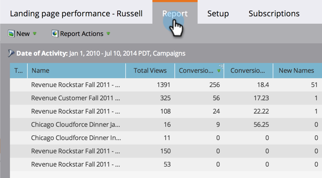
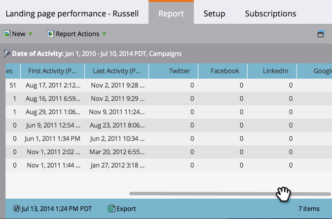

# ランディングページ効果レポート {#landing-page-performance-report}

ランディングページのフォームに入力した人数とそのうち何人が新規なのかを確認します。

>[!NOTE]
>
>スマートリストとランディングページパフォーマンスレポートの間に数値に違いがある場合は、スマートリストは人物に関するデータのみをフィルタリングするのに対し、ランディングページパフォーマンスレポートにはソーシャル（Facebook、Google Adsなど）が含まれている可能性があります 匿名のアクティビティを追加する必要があります。

1. [レポートを作成](/help/marketo/product-docs/reporting/basic-reporting/creating-reports/create-a-report-in-a-program.md)し、[!UICONTROL ランディングページ効果][レポートタイプ](/help/marketo/product-docs/reporting/basic-reporting/report-types/report-type-overview.md)を選択します。
1. [レポート時間枠を設定](/help/marketo/product-docs/reporting/basic-reporting/editing-reports/change-a-report-time-frame.md)し、「[!UICONTROL レポート]」タブをクリックします。
1. レポートを参照して、ランディングページの効果を評価します。

   

   ランディングページパフォーマンスレポートの列の中で、コンバージョンとコンバージョン率は、ユーザがフォームに入力した回数を反映しています。

   >[!TIP]
   >
   >コンバージョン率が最も高いページを見つけます。 その列で[レポートを並べ替え](/help/marketo/product-docs/reporting/basic-reporting/editing-reports/sort-report-on-columns.md)て、「降順に並べ替え」を選択します。

   レポートの AB アイコンは、統計がその[ランディングページのテストグループ](/help/marketo/product-docs/demand-generation/landing-pages/understanding-landing-pages/landing-page-test-groups.md)のすべてのページの合計であることを示します。

1. 右にスクロールして、様々なソーシャルメディアプラットフォームからの訪問数を確認します。

   

>[!MORELIKETHIS]
>
>ローカルまたはグローバルアセットで[ランディングページのパフォーマンスレポートをフィルタリング](/help/marketo/product-docs/demand-generation/landing-pages/landing-page-actions/filter-a-landing-page-performance-report.md)します。
