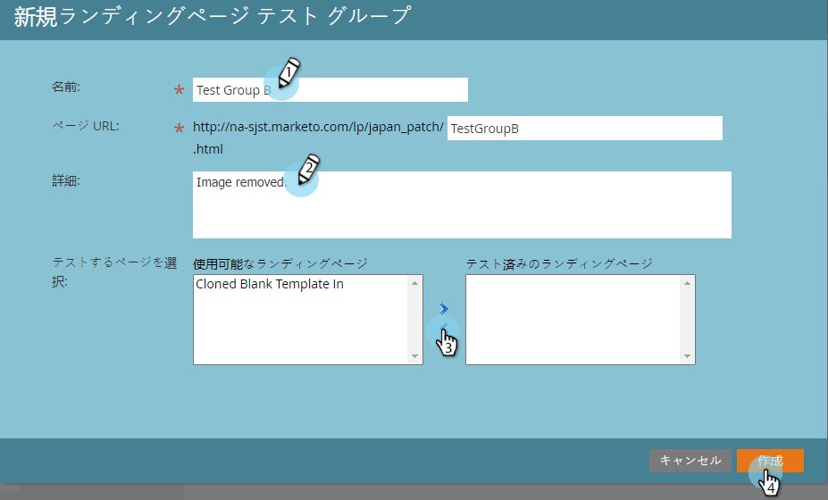

# ランディングページのテストグループ {#landing-page-test-groups}

Marketo は、テストグループ内のテスト対象の各ページのページビュー数とフォーム完了数を追跡します。 テストグループの結果を使用して、最も魅力的なランディングページを特定できます。 テストグループを作成する方法は、次のとおりです。

>[!PREREQUISITES]
>
>[2 つ以上のランディングページを作成します。](/help/marketo/getting-started/quick-wins/landing-page-with-a-form.md)できればフォームを使用します。

1. Design Studio で「**[!UICONTROL 新規作成]**」をクリックします。 ドロップダウンで、**[!UICONTROL 新規テストグループ]**&#x200B;を選択します。

   

   >[!NOTE]
   >
   >テストグループを作成するその他の方法は次のとおりです。
   >
   >* ツリー内のランディングページを右クリックし、「**[!UICONTROL テストグループに変換]**」を選択します。
   >* **[!UICONTROL 新規ローカルアセット]**&#x200B;メニューで「**[!UICONTROL A/B テストグループ]**」を選択して、プログラムでランディングページテストグループを作成することもできます。

1. 名前を入力し、オプションで説明も入力します。 テストするランディングページを選択し、「**[!UICONTROL 作成]**」をクリックします。

   

   >[!NOTE]
   >
   >選択できるのは、未承認のランディングページだけです。

1. 各ランディングページを右クリックして「**[!UICONTROL 承認]**」を選択します。

   

1. 「**[!UICONTROL テストグループアクション]**」ドロップダウンをクリックし、「**[!UICONTROL テストグループを承認]**」を選択します。

   

   選択したランディングページの統計情報を比較できるようになりました。

   

   >[!TIP]
   >
   >テストグループを削除する場合は、**[!UICONTROL テストグループアクション]**&#x200B;をクリックし、**[!UICONTROL テストグループを削除]**&#x200B;を選択します。
