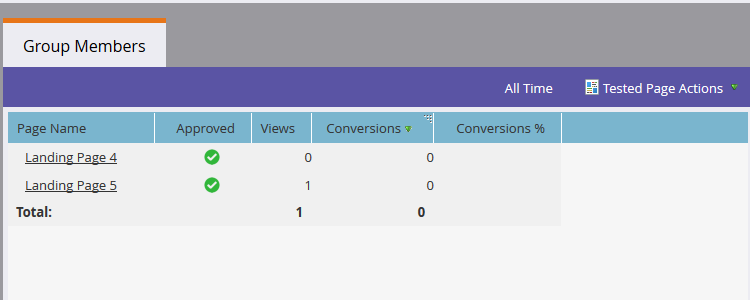

# ランディングページテストグループ {#landing-page-test-groups}

マーケティング担当者は、テストグループ内のテスト済みの各ページにおけるページ表示数とフォームの完了数を追跡します。 テストグループの結果を使用して、どのランディングページが最も説得力のあるものかを判断できます。 次に、テストグループの作成方法を示します。

>[!NOTE]
>
>**前提条件**
>
>[2つ以上のランディングページ](../../../../getting-started/quick-wins/landing-page-with-a-form.md)（好ましくはフォームを使用）を作成します。

1. Design Studioで、[ **新規作成**]をクリックします。 ドロップダウンで[ **新規テストグループ**]を選択します。

   

   >[!NOTE]
   >
   >テストグループを作成する他の方法は次のとおりです。
   >
   >    
   >    
   >    * ツリー内のランディングページを右クリックし、「 **Convert to Test Group」を選択します**
   >    * プログラムでランディングページテストグループを作成するには、 **新規ローカルアセット** メニューで「 **ABテストグループ** 」を選択します。

1. 名前と説明（オプション）を入力します。 テストするランディングページを選択し、「 **作成**」をクリックします。

   

   >[!NOTE]
   >
   >未承認のランディングページのみを選択できます。

1. 各ランディングページを右クリックし、「 **承認**」を選択します。

   

1. 「 **テストグループオプション** 」ドロップダウンをクリックし、「テストグループの **承認**」を選択します。

   

   それだ！ これで、選択したランディングページの統計を比較できます。

   

   >[!TIP]
   >
   >テストグループを削除する場合は、「 **Test Group Actions** 」をクリックし、「 **Delete test group**」を選択します。

