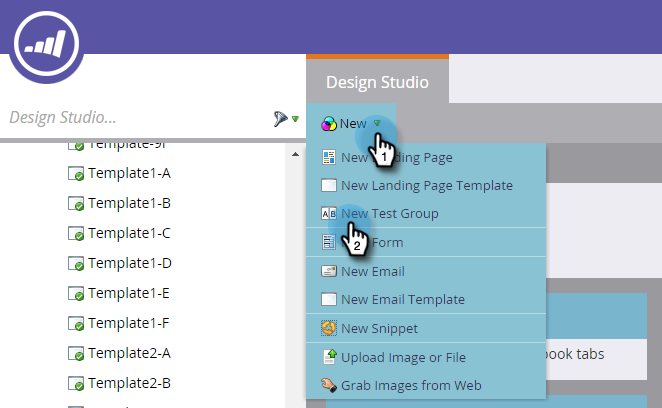

# ランディングページテストグループ{#landing-page-test-groups}

マーケティング担当者は、テストグループ内のテスト済みの各ページにおけるページ表示数とフォームの完了数を追跡します。 テストグループの結果を使用して、どのランディングページが最も説得力のあるものかを判断できます。 次に、テストグループの作成方法を示します。

>[!PREREQUISITES]
>
>[2つ以上のランディングページ](/help/marketo/getting-started/quick-wins/landing-page-with-a-form.md)（好ましくはフォームを使用）を作成します。

1. Design Studioで、「**新規**」をクリックします。 ドロップダウンで[**新しいテストグループ**]を選択します。

   

   >[!NOTE]
   >
   >テストグループを作成する他の方法は次のとおりです。
   >
   >* ツリー内のランディングページを右クリックし、「**テストグループに変換**」を選択します。
   >* **新しいローカルアセット**&#x200B;メニューで「**ABテストグループ**」を選択して、プログラムでランディングページテストグループを作成します

1. 名前と説明（オプション）を入力します。 テストするランディングページを選択し、「**作成**」をクリックします。

   

   >[!NOTE]
   >
   >未承認のランディングページのみを選択できます。

1. 各ランディングページを右クリックし、「**承認**」を選択します。

   

1. 「**テストグループのオプション**」ドロップダウンをクリックし、「**テストグループの承認**」を選択します。

   

   それだ！ これで、選択したランディングページの統計を比較できます。

   

   >[!TIP]
   >
   >テストグループを削除したい場合は、「**テストグループのアクション**」をクリックし、「**テストグループ**&#x200B;を削除」を選択します。
