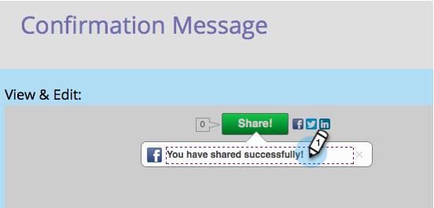

# 共有後のプロンプトの構成{#configure-after-share-prompts}

ソーシャルボタン、ビデオ共有および投票アプリでは、ユーザーがソーシャルネットワークでコンテンツを共有した後の動作を選択できます。

1. **マーケティングアクティビティ**&#x200B;に移動します。

   

1. アプリを選択し、「**ドラフトを編集**」をクリックします。

   

1. Social App Editorで、「**アプリ設定**** **」、「**詳細オプション**」の順に移動します。

   

1. 「**共有後**」に対して、使用する動作を選択します。

   

   * **確認メッセージ：** 個人が共有されたら、確認メッセージを表示します。
   * **電子メールキャプチャ：** 個人が共有されたら、電子メールアドレスをリクエストします。

   >[!NOTE]
   >
   >「**Eメールキャプチャ**」を選択した場合、リクエストは、ユーザーがまだ情報を入力していない場合にのみ表示されます。

1. 「**確認メッセージ：****共有フロー**&#x200B;に移動」を選択し、**確認メッセージ**&#x200B;を開きます。

   

1. 確認メッセージを編集します。

   

1. 「**Eメールキャプチャ**」を選択した場合（確認ではなく）、次のようになります。「**フローを共有**」に移動し、「**電子メールキャプチャ**」に移動します。

   

1. マーケティングプロンプトを含めるかどうか、およびそのチェックボックスがデフォルトで選択されている(**オプトアウト**)かどうかを選択します(**オプトイン**)。

   

1. 電子メールアドレスのリクエストとマーケティングプロンプトを編集します（電子メールアドレスを含めた場合）。

   

