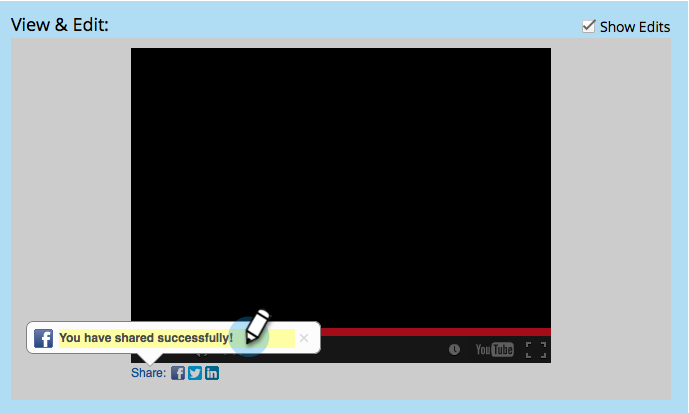

# ソーシャルレコメンデーションフローの設定{#configure-social-recommend-flow}

ソーシャルアプリを作成する際に、ソーシャルネットワークの選択肢と、ユーザーがサインアップする際に表示されるプロンプトを設定できます。

## 共有するネットワークの選択{#select-networks-for-sharing}

>[!NOTE]
>
>これは、[ソーシャルサインアップ/共有フロー](/help/marketo/product-docs/demand-generation/social/configuring-social-actions/configure-social-sign-up-share-flow.md)の設定と非常に似ていますが、これは、ソーシャルアプリの&#x200B;_下の共有リンク_&#x200B;の設定です。

1. **マーケティングアクティビティ**&#x200B;に移動します。

   

1. アプリを選択し、「**ドラフトを編集**」をクリックします。

   

1. Social App Editorで、**レコメンデーションフロー**/**ソーシャルネットワーク**&#x200B;に移動します。

   

1. ユーザーが共有できるネットワークを選択します。

   

## Facebookメッセージの設定{#configure-the-facebook-message}

1. Facebook投稿に表示するメッセージを設定します。

   

   >[!NOTE]
   >
   >ビデオ共有では、サムネールが自動的に生成されます。

   「**動的コンテンツ**」を追加選択すると、ページのOpenGraphタグ（og:title、og:captionおよびog:description）の値とサムネールがFacebook投稿に自動的に追加されます。 次の手順を参照してください。

   「**追加静的コンテンツ**」を選択した場合は、タイトル、キャプション、説明を入力し、画像をアップロードします。 次の2つの手順を参照してください。

1. 表示と編集ウィンドウで、「**編集を表示**」をクリックして、Facebook投稿に表示される共有プロンプトとメッセージをカスタマイズします。

   >[!TIP]
   >
   >詳しくは、[Facebookのリッチ投稿設定の編集](/help/marketo/product-docs/demand-generation/facebook/edit-facebook-rich-post-settings.md)を参照してください。

   

   >[!NOTE]
   >
   >[共有URL](/help/marketo/product-docs/demand-generation/social/social-functions/choose-the-share-url-for-a-social-app.md)は、すべての共有メッセージに自動的に追加されます。

1. 上記で「**追加静的コンテンツ**」を選択した場合は、タイトル、キャプションおよび説明を編集し、カスタム画像を（マーケティング用の画像とファイルから）アップロードします。

   

   「[マーケティング対象の追加画像とファイル](/help/marketo/product-docs/demand-generation/images-and-files/add-images-and-files-to-marketo.md)」を参照してください。

   >[!NOTE]
   >
   >画像をアップロードすると、Socialアプリのエディターを閉じてから再度開くまで、画像はここに表示されません。

1. 「**次へ**」をクリックします。

を選択すると、ページのOpenGraphタグ（og:title、og:captionおよびog:description）の値とサムネールが自動的にFacebook投稿に追加されます。 次の手順を参照してください。

## Twitterメッセージの設定{#configure-the-twitter-message}

1. をクリックして、Twitterのツイートに表示される共有プロンプトとメッセージを編集します。

   

   >[!TIP]
   >
   >ツイートのテキストで{html_title}を使用すると、ページのタイトルが自動的に表示されます。

1. 「**次へ**」をクリックします。

## LinkedInメッセージの設定{#configure-the-linkedin-message}

1. LinkedIn投稿に表示するメッセージを設定します。

   

   **動的追加**&#x200B;コンテンツを選択すると、ページタグ（タイトルと説明）の値とサムネールがLinkedInの投稿に自動的に追加されます。 次の手順を参照してください。

   「**静的追加**&#x200B;コンテンツ」を選択した場合は、タイトル、キャプション、説明を入力し、画像をアップロードします。 次の2つの手順を参照してください。

1. **表示と編集**&#x200B;ウィンドウで、**編集を表示**&#x200B;をクリックし、LinkedIn投稿に表示される共有プロンプトとメッセージを編集します。

   

   >[!TIP]
   >
   >投稿のテキストで{html_title}を使用すると、ページのタイトルが自動的に表示されます。

1. 上記の「**静的追加**&#x200B;コンテンツ」を選択した場合は、タイトルと説明を編集し、カスタム画像を（マーケティング用の画像とファイルから）アップロードします。

   

   「[マーケティング対象の追加画像とファイル](/help/marketo/product-docs/demand-generation/images-and-files/add-images-and-files-to-marketo.md)」を参照してください。

   >[!NOTE]
   >
   >画像をアップロードすると、Socialアプリのエディターを閉じてから再度開くまで、画像はここに表示されません。

1. 「**次へ**」をクリックします。

## 確認メッセージの構成{#configure-the-confirmation-message}

1. 共有の確認のテキストを編集します。

   

1. **完了**/**承認**&#x200B;と&#x200B;**閉じる**&#x200B;をクリックします。

   

>[!MORELIKETHIS]
>
>次の手順は、[ビデオ共有](/help/marketo/product-docs/demand-generation/social/configuring-social-actions/customize-video-share-flow.md)または[ポール](/help/marketo/product-docs/demand-generation/social/creating-a-poll/create-a-poll.md)をランディングページ、Facebook、または自分のWebサイトに追加します。
