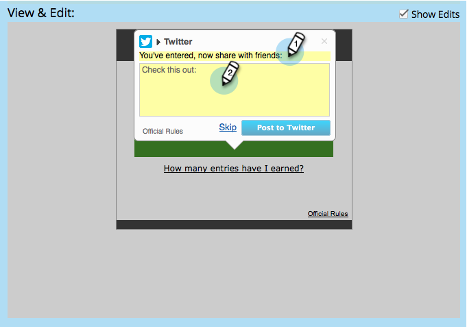

# Social の新規登録／共有フローの設定 {#configure-social-sign-up-share-flow}

ソーシャルアプリを作成する際、ユーザーが新規登録すると表示されるソーシャルネットワークの選択肢とプロンプトを設定できます。

## 共有するネットワークの選択 {#select-networks-for-sharing}

1. **マーケティングアクティビティ**&#x200B;に移動します。

   

1. アプリを選択し、「**ドラフトを編集**」をクリックします。

   

1. ソーシャルアプリエディターで、**新規登録フロー**／**ソーシャルネットワーク**&#x200B;をクリックします。

   

1. ユーザーが共有できるネットワークを選択（または選択解除）します。

   

## Facebook メッセージの設定 {#configure-the-facebook-message}

1. **新規登録フロー**／**メッセージの共有**&#x200B;に移動します。

   

1. Facebook の投稿に表示するメッセージを設定します。

   

   >[!NOTE]
   >
   >ビデオ共有では、サムネールが自動的に生成されます。

   「**動的コンテンツを追加**」を選択すると、ページの&#x200B;**OpenGraph**&#x200B;タグ（og:title、og:caption、および og:description）の値とサムネールが Facebook の投稿に自動で追加されます。次の手順を参照してください。

   「**静的コンテンツを追加**」を選択した場合は、タイトル、キャプション、説明を入力し、画像をアップロードします。次の 2 つの手順を参照してください。

1. 表示と編集ウィンドウで、「**編集内容を表示**」をクリックし、Facebook の投稿に表示される共有プロンプトとメッセージを編集します。

   >[!TIP]
   >
   >詳しくは、[Facebook のリッチ投稿設定の編集](/help/marketo/product-docs/demand-generation/facebook/edit-facebook-rich-post-settings.md)を参照してください。

   

   >[!NOTE]
   >
   >[共有 URL](/help/marketo/product-docs/demand-generation/social/social-functions/choose-the-share-url-for-a-social-app.md) は、すべての共有メッセージに自動的に追加されます。

1. 上記の「**静的コンテンツを追加**」を選択した場合は、タイトル、キャプションおよび説明を編集し、カスタム画像を（[**Marketo の画像とファイル**](/help/marketo/product-docs/demand-generation/images-and-files/add-images-and-files-to-marketo.md)&#x200B;から）アップロードします。

   

   [Marketo への画像とファイルの追加](/help/marketo/product-docs/demand-generation/images-and-files/add-images-and-files-to-marketo.md)を参照してください。

   >[!NOTE]
   >
   >画像をアップロードすると、ソーシャルアプリエディターを閉じて再度開くまで、ここには表示されません。

1. 「**次へ**」をクリックします。

ページのタグ（og:title、og:caption および og:description）の値を選択すると、サムネールが Facebook の投稿に自動的に追加されます。次の手順を参照してください。

## Twitter メッセージの設定 {#configure-the-twitter-message}

1. Twitter のツイートに表示される共有プロンプトとメッセージを編集します。

   

   >[!TIP]
   >
   >ツイートのテキストに {html_title} を使用すると、ページのタイトルが自動的に表示されます。

1. 「**次へ**」をクリックします。

## LinkedIn メッセージの設定 {#configure-the-linkedin-message}

1. LinkedIn の投稿に表示するメッセージを設定します。

   

   「**動的コンテンツを追加**」を選択すると、ページタグ（タイトルと説明）の値とサムネールが LinkedIn の投稿に自動で追加されます。次の手順を参照してください。

   「**静的コンテンツを追加**」を選択した場合は、タイトル、キャプションおよび説明を入力し、画像をアップロードします。次の 2 つの手順を参照してください。

1. **表示と編集**&#x200B;ウィンドウで、「**編集内容を表示**」をクリックし、LinkedIn の投稿に表示される共有プロンプトとメッセージを編集します。

   

   >[!TIP]
   >
   >投稿のテキストで {html_title}を 使用して、ページのタイトルを自動的に表示します。

1. 上記の「**静的コンテンツを追加**」を選択した場合はタイトルおよび説明を編集し、カスタム画像を（[**Marketo の画像とファイル**](/help/marketo/product-docs/demand-generation/images-and-files/add-images-and-files-to-marketo.md)&#x200B;から）アップロードします。

   

>[!NOTE]
>
>画像をアップロードすると、ソーシャルアプリエディターを閉じて再度開くまで、ここには表示されません。

>[!MORELIKETHIS]
>
>次に、**完了**／**承認して閉じる**&#x200B;をクリックし、ソーシャルアプリをランディングページに配置します。また、[ユーザーキャプチャ](/help/marketo/product-docs/demand-generation/social/configuring-social-actions/configure-person-capture-for-a-social-app.md)や[再共有プロンプト](/help/marketo/product-docs/demand-generation/social/configuring-social-actions/configure-re-share-email-and-prompt-for-a-social-app.md)を設定することもできます。
