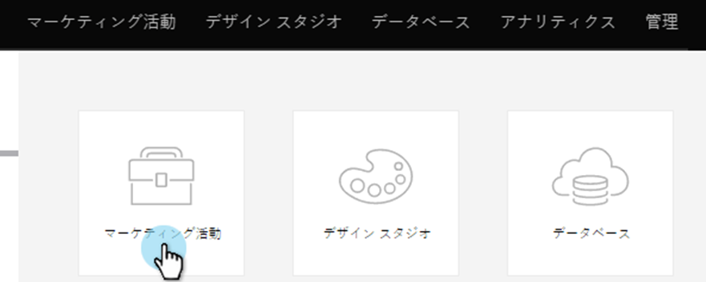

# リファラルオファーの進捗フローの追跡の設定{#configure-track-progress-flow-for-a-referral-offer}

[参照オファー](../../../../product-docs/demand-generation/social/referral-offers/create-a-referral-offer.md)を作成するとき、参加者に報酬に向けての進捗状況を示すプロンプトを設定できます。

1. **マーケティングアクティビティ**&#x200B;に移動します。

   

1. 参照オファーーを選択し、「**ドラフトを編集**」をクリックします。

   

1. 参照オファーエディターで、**進行状況の追跡フロー**/**ソーシャルネットワーク**&#x200B;に移動します。

   

1. **表示** **&amp;** **編集**&#x200B;ウィンドウで、参加者がオファーのサインアップに使用したのと同じソーシャルネットワークにサインインするよう促すプロンプトを編集します。

   

   >[!NOTE]
   >
   >編集可能なテキストをハイライト表示するには、右上隅の「**編集内容を表示**」を選択します。

1. 参加者にリンクを他の友達と共有するよう促すプロンプトを編集します。

   

1. 受渡目標を達成し、電子メールを確認する必要があることを参加者に知らせるプロンプトを編集します。

   

1. 成功した参加者に、報酬を支払う関連プロモーションコードを知らせるメッセージを編集します。

   

>[!MORELIKETHIS]
>
>次に、**完了/承認/**&#x200B;をクリックし、[参照オファー](../../../../product-docs/demand-generation/social/referral-offers/publish-a-referral-offer.md)を公開します。

