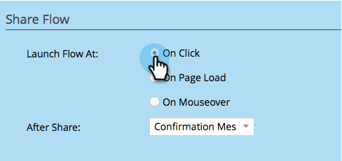

# ソーシャルボタンが開くタイミングを設定{#configure-when-social-button-opens}

[ソーシャルボタン](../../../../product-docs/demand-generation/landing-pages/free-form-landing-pages/add-a-social-button-to-a-free-form-landing-page.md)を作成する場合、ボタンが共有プロンプトを表示するタイミングを設定できます。

1. **マーケティングアクティビティ**&#x200B;に移動します。

   

1. アプリを選択し、「**ドラフトを編集**」をクリックします。

   

1. Social App Editorで、**アプリ設定**/**詳細オプションに移動します。**

   

1. 共有ボタンに共有のプロンプトが表示される場合に選択します。

   

   * **クリック時：訪問者がソーシャルボタン** をクリックしたとき。
   * **ページの読み込み時：ソーシャルボタン** を含むランディングページがユーザーのブラウザーに読み込まれるとすぐに。
   * **マウスオーバー時：人** がソーシャルボタンの上にカーソルを置いたとき。

   >[!NOTE]
   >
   >**関連記事**
   >
   >
   >ユーザーが共有したら、そのユーザーの電子メールアドレスを要求するか、確認メッセージを表示できます。 [共有後のプロンプト](configure-after-share-prompts.md)を設定する方法を説明します。

