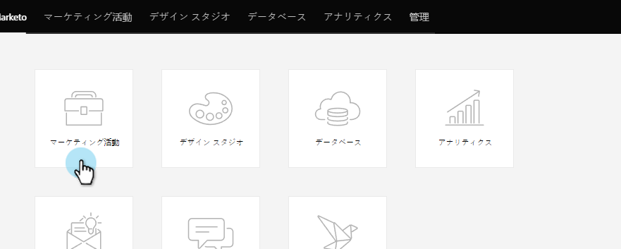

# Socialアプリのカスタマイズボタン{#customize-social-app-button}

[ソーシャルボタン](/help/marketo/product-docs/demand-generation/landing-pages/free-form-landing-pages/add-a-social-button-to-a-free-form-landing-page.md)または[参照オファー](/help/marketo/product-docs/demand-generation/social/referral-offers/create-a-referral-offer.md)を作成する場合、ボタンの外観をカスタマイズできます。

1. **マーケティングアクティビティ**&#x200B;に移動します。

   

1. アプリを選択し、「**ドラフトを編集**」をクリックします。

   

1. Social App Editorで、**アプリの設定**/**ボタンのスタイル**&#x200B;に移動します(参照オファーの場合は&#x200B;**サインアップスタイル，**)。

   

1. 共有数を表示する場所を選択するか、表示しない場所を選択します。

   

1. 対応するボタンと共に表示するソーシャルネットワークアイコンを選択します。

   

   >[!NOTE]
   >
   >参照オファーの場合は、**2の下のネットワークを選択してください。 入会フロー>ソーシャルネットワーク**。

1. ボタンの種類を選択します。

   

   >[!TIP]
   >
   >上記の「ボタンスタイル&#x200B;**」で「**&#x200B;画像をアップロード」を選択した場合は、以下のセクションで、テキストを編集する代わりにボタン画像をアップロードできます。

1. クリック前とクリック後のボタンのラベルを編集します。

   

1. 各選択を行うと、**表示と編集**&#x200B;ウィンドウで結果を確認します。

   

>[!NOTE]
>
>リファラルオファーでは、「**進捗状況を追跡**」ボタンをカスタマイズすることもできます。 **アプリ設定**/**進捗スタイルを追跡**&#x200B;に移動し、上記と同じ手順に従います。

>[!MORELIKETHIS]
>
>ソーシャルボタンの場合は、を開いたときに設定します。 参照オファーの場合、[オファー目標](/help/marketo/product-docs/demand-generation/social/referral-offers/specify-goal-for-referral-offer.md)を指定します。
