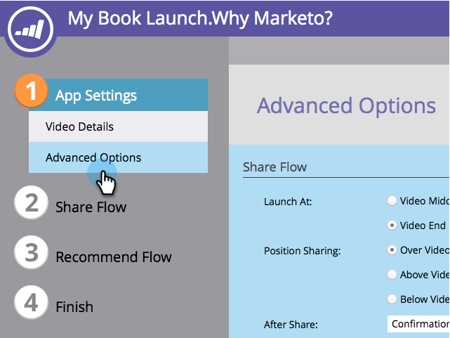
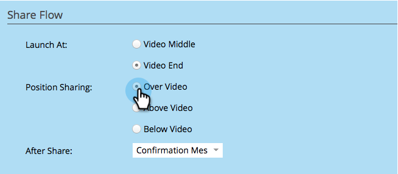

# ビデオ共有フローのカスタマイズ {#customize-video-share-flow}

ビデオ共有を [作成する際に](../../../../product-docs/demand-generation/landing-pages/free-form-landing-pages/add-a-video-to-a-free-form-landing-page.md)、共有プロンプトが表示される日時と場所をカスタマイズできます。

1. 「 **マーケティングアクティビティ**」に移動します。

   

1. アプリを選択し、「ドラフトを **編集」をクリックします。**

   

1. ビデオ共有エディターで、 **アプリ設定** / **詳細オプションに移動します。**

   

1. 共有をユーザーに促すプロンプトと、そのプロンプトが表示される場所を選択します。

   

>[!NOTE]
>
>**関連記事**
>
>次の手順は、ビデオ共有後の動作を [設定することです](configure-after-share-prompts.md)。

