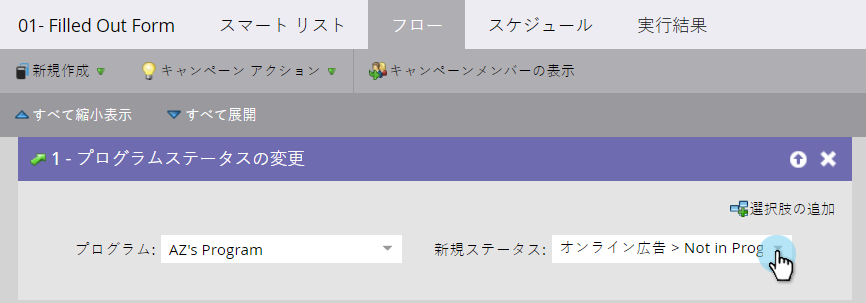

# デジタル広告キャンペーンの売上高アトリビューションの設定 {#set-up-revenue-attribution-for-digital-advertising-campaigns}

デジタル広告チャネルとキャンペーンの売上高アトリビューションを設定する方法を説明します。 設定後は、他のMarketoプログラムと同様に、デジタル広告に対してファーストタッチとマルチタッチの売上高属性を設定できます。

Marketoで最初の広告プログラムを設定したら、他のチャネル用にその広告プログラムを複製して更新できます。 例えば、LinkedInプログラムをFacebookプログラムにコピーします。

別々のプログラムを使用すると、それぞれのプログラムの変換数を追跡し、プログラムアナライザー、Opportunity Influence Analyzer、およびその他のMarketo Analytics 機能でプログラムを確認できます。

>[!PREREQUISITES]
>
>* ステータス値とプログラムの成功（デジタル広告、ソーシャル有料および PPC など）を含むチャネルタグの設定
>* クエリ文字列をユーザーに渡すフォームを作成または編集する
>* 一部の売上高サイクル分析機能にアクセスして、広告チャネルとキャンペーンに関するレポートを作成してください

## デフォルトプログラムの作成 {#create-a-default-program}

特定の期間、定期的に実行されるプログラム（電子メールなど）とは異なり、デフォルトのプログラムは常にオンになっています。

1. **マーケティングアクティビティ**&#x200B;に移動します。

   

1. クリック **新規** を選択します。 **新規プログラム**.

   

1. 既にプログラムがある場合は、 [クローン](/help/marketo/product-docs/core-marketo-concepts/programs/working-with-programs/clone-a-program.md).

   >[!TIP]
   >
   >プログラムを複製する場合は、必ずスマートリストのクエリー文字列フィールドの名前を置き換えてください。

1. 最初のプログラムを設定した後、特定のキャンペーンフォルダーに新しいプログラムを配置します。

   >[!NOTE]
   >
   >**例**
   >
   >URL を通じて渡されるクエリ文字列は、Marketoでのユーザーになったときにユーザーがクリックした広告キャンペーンをMarketoが把握するのに役立ちます。
   >
   >測定対象のすべての変数を含むクエリー文字列手法を作成できます。 Marketoは、これらの変数を使用して、ユーザーを異なるプログラムに追加します。
   >
   >例えば、Channel type_Channel__Asset__Region を使用できます。 次のようになります。SP_FB_NewGuide_US。 **注意**:省略形はスペースを節約します。
   >
   >または、 Channel_Adsource_AssetName_Region_UniqueIdNumber として設定します。 次のようになります。Social-Paid_Facebook_NewGuide_NA_123.

## 新しい名前用のスマートキャンペーンの作成 {#create-a-smart-campaign-for-new-names}

1. スマートキャンペーンで、図のように、2 つのトリガーと 2 つのフィルターを含むスマートリストを作成します。

   

   >[!NOTE]
   >
   >2 つのクエリで使用されるトリガー列と **名前をキャプチャしたプログラム** フィルターは一意です。 ここに示すクエリー文字列は、例です。 フィールドを複製した場合は、これらのフィールドを置き換えます。

1. 属性を変更するフローステップの作成 **獲得プログラム** 「新しい値」に、有料ソーシャルキャンペーン用に定義した値を設定します。

   

1. キャンペーンのスケジュールを設定し、アクティブ化します。

## ステータス/プログラム成功のためのスマートキャンペーンの作成 {#create-a-smart-campaign-for-status-program-success}

ユーザーのステータスを変更するには、2 つ目のスマートキャンペーンが必要です。これにより、ユーザーはプログラムの成功を達成し、売上高アトリビューションの計算に含めることができます。

1. の **Fills Out Form** トリガーで、クエリー文字列にプログラム名を入力します。 プログラムを複製する場合は、古いクエリー文字列名を新しい名前に置き換えます。

   

1. フローステップを作成して、ステータスをプログラムの成功に関連付けられたステータスに変更します。

   

   >[!NOTE]
   >
   >上記の例は、を示しています。 **Converted**&#x200B;ですが、これはステータスや成功の値によって異なります。

1. キャンペーンのスケジュールを設定し、アクティブ化します。

## 広告の作成 {#create-your-ad}

プログラムとキャンペーンを設定したら、新しい広告を作成します。

1. チャネルに移動します。例：LinkedIn、Facebook
1. 新しい広告を作成します。
1. キャンペーンのコールトゥアクションの宛先として、Marketoのランディングページを選択します。
1. URL にクエリー文字列を追加します。

   >[!NOTE]
   >
   >**例**
   >
   >設定したすべての情報を実際の URL に追加する方法を次に示します。 項目はアンパサンド (&amp;) で区切られます。
   >
   >`www.marketo.com?**source**=Social-Paid&**comment**=Social-Paid_Facebook_NewGuide_NA&**camp**=abc&**kk=**xyz`
   >
   >* **source** は、チャネル識別子として使用されるユーザーソースです
   >* **コメント** は、各プログラムに対して作成される一意の識別子です。
   >* **キャンプ** は、Facebook、LinkedInまたはGoogleのキャンペーンです。
   >* **kk** は、取り込むキーワードまたはアセット名です。

   >
   >**これら 4 つの用語はすべて小文字にする必要があり、URL にこの情報を取り込むためのスペースを含めることはできません。**

## ベスト プラクティス {#best-practices}

1 つのチャネルタグを使用してすべてのデジタル広告を表すか、他のマーケティングチャネル（ソーシャル有料、検索有料、ディスプレイ、リターゲティングなど）とより詳細に比較したい場合は複数のチャネルタグを使用します。

次に、必要なレポート表示ごとに異なるプログラムを設定します。 「Big Campaign」を起動する 10 の地域があり、複数の地域で結果を表示できるようにする場合は、クエリ文字列で、URL（BC など）のパラメーターとして共通 ID を使用します。

各地域とビッグキャンペーンの全体の結果を報告する場合は、11 のプログラムを作成します。各地域に 1 つ、ビッグキャンペーンに 1 つです。 各プログラムは、クエリー文字列（BC など）の関連する文字のみを参照します。

ビッグキャンペーンと地域プログラムの間には意図的な重複が存在するので、11 のプログラムの総人数を報告する必要はありません。ビッグキャンペーンと地域プログラムの両方に含まれる人々がいるからです。
