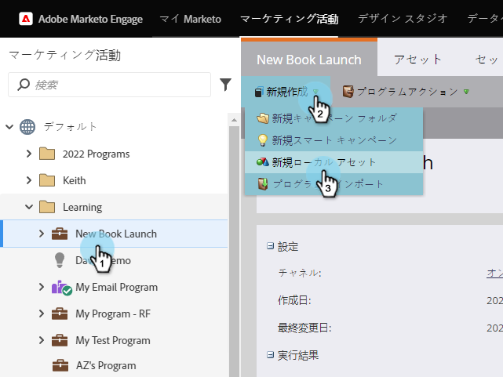
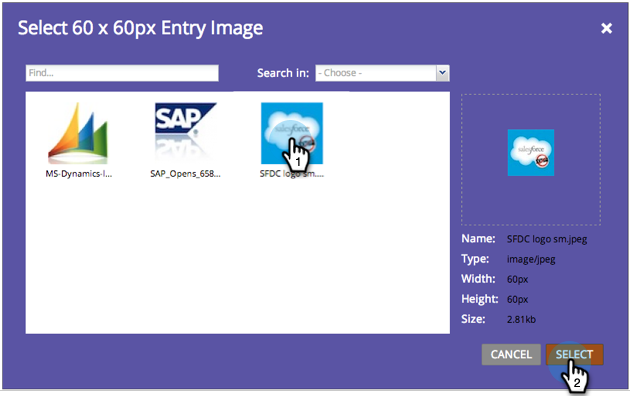

# ポールの作成{#create-a-poll}

投票で人を惹きつけ、ソーシャルネットワークで投票して友達と共有できます。 ランディングページ、Webサイト、Facebookなどの場所に追加できます。

>[!AVAILABILITY]
>
>この機能を購入していないお客様もいます。 詳細については、セールス担当者にお問い合わせください。

>[!PREREQUISITES]
>
>調査に画像を使用する場合は、開始する前に、画像をマーケティング先の画像およびファイルライブラリに追加します。 各ポー追加ルエントリの60 x 60ピクセルの画像。 「[マーケティング対象の追加画像とファイル](/help/marketo/product-docs/demand-generation/images-and-files/add-images-and-files-to-marketo.md)」を参照してください。

1. プログラムー内で、**新規**/**新規ローカルアセット**&#x200B;を選択します。

   

1. **ローカルアセットギャラリー**&#x200B;で、**調査**&#x200B;をクリックします。

   

1. 調査に名前を付けます。

   

   >[!TIP]
   >
   >時間を節約するために、「**コピー元**」オプションを使用して、既存のビデオ共有からすべての設定をコピーできます。

1. 調査の見出しを付けます（通常は短い質問です）。

   

1. エントリごとに、タイトルと説明を編集します。

   

1. エントリを追加するには、**+**&#x200B;記号をクリックし、タイトルと説明を編集します。

   

1. エントリごとに、番号付きのサムネールをクリックして画像を追加できます。

   

1. 必要な画像を選択し、「**選択**」をクリックします。

   

1. すべてのエントリに対してサムネール、タイトル、説明を設定したら、「**完了**」をクリックします。

   

1. 「**承認**」と「**閉じる**」をクリックします。

   

調査エディターが新しいウィンドウで開きます。 デフォルトの設定は問題ありませんが、ポールエントリを追加する必要があります。 次の手順を説明します。

>[!TIP]
>
>ポールのデフォルト値を変更するには、[**戻る**]をクリックします。 承認せずに後で作業を保存するには、[**閉じる**]をクリックします。

調査に問題がある場合は、調査が承認される前に問題の解決を促すメッセージが表示されます。 おめでとう！ ポールが作成されました。

>[!MORELIKETHIS]
>
>次の手順は[調査](/help/marketo/product-docs/demand-generation/social/creating-a-poll/publish-a-poll.md)を公開することですが、必要に応じて調査の設定を変更できます。 [ポーリング設定](/help/marketo/product-docs/demand-generation/social/creating-a-poll/customize-poll-settings.md)のカスタマイズとの開始。
