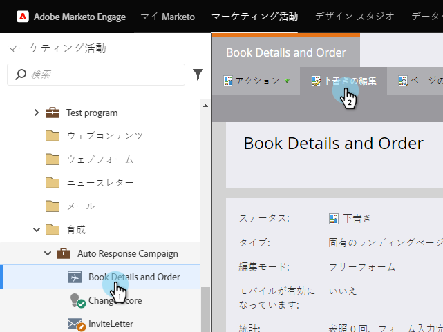

# ポールの公開 {#publish-a-poll}

調査は [作成した後](create-a-poll.md)、Marketorランディングページ、FacebookおよびWebサイトに投稿できます。

1. ランディングページーに移動し、編集用に開きます。

   

1. 右側のパレット **から** 「投票」の上にドラッグします。

   

1. 調査を選択し、「 **挿入」をクリックします。**

   

>[!NOTE]
>
>**Reminder**
>
>ここで調査を利用できるようにするには、調査を承認する必要があります。

おめでとう！ ランディングページを承認すると、調査は実行中です。 また、ランディングページをFacebookに [投稿したり、調査をWebサイトに](../../../../product-docs/demand-generation/facebook/publish-landing-pages-to-facebook.md) 投稿したりできます 。

>[!TIP]
>
>調査をテストし、絞り込みます。 Webページの調査に移動し、テスト情報を使用してサインアップします。 ユーザーのエクスペリエンスに関して変更したいことをすべて控えておいてください。

