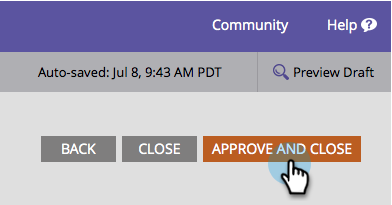

# 照会オファーの作成 {#create-a-referral-offer}

照会オファーは、人々に友達を照会するインセンティブを与えます。 照会を成功させるための目標と報酬を作成します。 ランディングページやWebサイト、さらにはFacebookにも投稿できます。

>[!NOTE]
>
>**可用性**
>
>この機能を購入していないお客様もいます。 詳細については、セールス担当者にお問い合わせください。

1. プログラム内で、 **新規** / **新規ローカルアセットを選択します。**

   

1. ロー **カルアセットギャラリーで、** 「 **参照オファー」をクリックします。**

   

1. 照会オファーに名前を付けます。

   

   >[!TIP]
   >
   >時間を節約するために、「 **Clone From** 」オプションを使用して、既存の参照オファーからすべての設定をコピーできます。

   参照オファーエディターが新しいウィンドウで開きます。 デフォルト設定は問題ありませんが、オファーのルール（利用条件）へのリンクを追加する必要があります。 共有メッセージ画面の下部にリンクが表示されます。 次の手順を説明します。

1. 「 **詳細オプション」をクリックします。**

   

1. オファー追加のルールへのリンク。 URLを入力し **ます。**

   

   >[!NOTE]
   >
   >この画面で、プライバシーポリシーリンクを追加することもできます。 「Socialアプリ [に対するプライバシーポリシー」を追加参照してください](../../../../product-docs/demand-generation/social/social-functions/add-your-privacy-policy-to-a-social-app.md)。

1. 「 **完了」をクリックします。**

   

1. 「 **承認して** 閉じる」 ******をクリックします。**

   >[!TIP]
   >
   >参照オファーのデフォルトを変更するには、[ **戻る**]をクリックします。 承認せずに後で作業を保存するには、「 **閉じる」をクリックします。**

   

参照オファーに問題がある場合は、オファーが承認される前に、問題の対処を求めるメッセージが表示されます。

おめでとう！ 照会オファーを作成しました。

>[!MORELIKETHIS]
>
>次の手順は、参照オファーをランディングページ、Webサイト [、またはFacebookに](publish-a-referral-offer.md) 公開することです。

>[!NOTE]
>
>**ディープダイブ**
>
>デフォルトの設定、文字列、メッセージはすべて変更できます。

