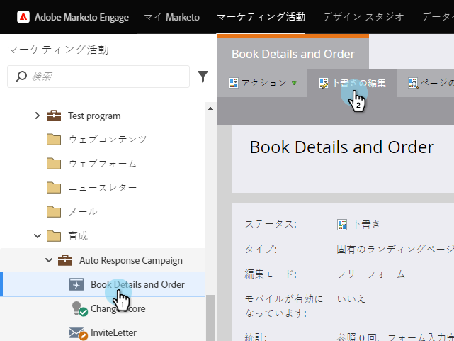

# 参照オファーの発行{#publish-a-referral-offer}

[参照オファー](create-a-referral-offer.md)を作成したら、Marketorランディングページ、Facebook、Webサイトに投稿できます。

1. ランディングページーに移動し、編集用に開きます。

   

1. 右側のパレットから&#x200B;**参照オファー**&#x200B;の上にドラッグします。

   

1. 参照オファーーを選択し、「**挿入**」をクリックします。

   

>[!NOTE]
>
>**Reminder**
>
>参照オファーをここで利用できるようにするには、参照情報を承認する必要があります。

おめでとう！ ランディングページを承認すると、参照オファーが有効になります。 また、ランディングページをFacebookに[投稿したり、[Webサイトにオファーを置いたりすることもできます。](../../../../product-docs/demand-generation/social/social-functions/deploy-social-on-your-website.md)](../../../../product-docs/demand-generation/facebook/publish-landing-pages-to-facebook.md)

>[!TIP]
>
>照会オファーをテストし、調整します。 Webページのオファーにアクセスし、テスト情報を入力して登録します。 ユーザーのエクスペリエンスに関して変更したいことをすべて控えておいてください。

