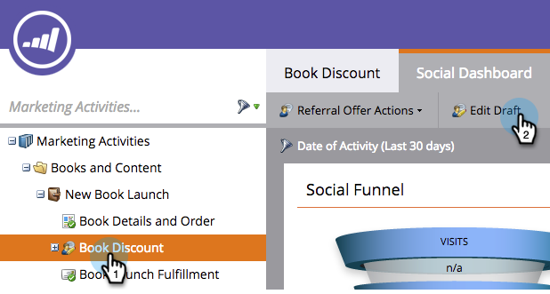

# 照会オファーの受渡通知電子メールの送信 {#send-referral-offer-fulfillment-email}

オファー購読提供数電子メールを使用して、クーポンと割引コードを利用して顧客に報酬を提供します。

>[!PREREQUISITES]
>
>* [Social Promotionでの電子メールの使用](../../../../product-docs/demand-generation/social/social-functions/use-emails-in-social-promotions.md)
>* [照会オファーの作成](create-a-referral-offer.md)

>

## 購読提供数配信の設定 {#set-up-fulfillment-delivery}

1. 照会オファーを選択します。 「ドラフト **を編集**」をクリックします。

   

1. 「 **アプリ設定**」で、「 **オファーの詳細」を選択します。**

   ** 

   **

1. 入 **会用電子メールを選択します**。

   

1. 「 **購読提供数電子メール**」を選択します。

   

   >[!NOTE]
   >
   >**ディープダイブ**
   >
   >
   >ソーシャルプロモーションでの電子メールの [使用について詳しく説明します](../../../../product-docs/demand-generation/social/social-functions/use-emails-in-social-promotions.md)。

1. 「 **受渡配信** 」ドロップダウンをクリックし、「 **自動目標**」を選択します。

   

   「 **購読提供数の電子メール** 」で選択したメッセージは、目標を満たす人に自動的に送信されます。

## 手動送信 {#manual-send}

目標を達成したユーザーには、受渡通知メールを手動で送信できます。

1. 参照オファーを選択し、「 **参加者** 」タブをクリックします。

   

1. 「**フィルタ条件**」オプションをクリックし、「 **目標**」を選択します。

   >[!NOTE]
   >
   >これにより、照会オファーの目標を達成した人が選択されます。

   

1. フィルターを適用した表示のユーザーを選択します。

   

1. 右クリックし、「購読提供数電子メール **を送信**」を選択します。

   

すごい！ 受渡通知メールを受け取り、報酬についてかき集められる。
