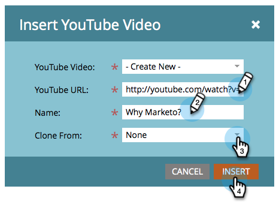

# 追加ビデオ {#add-a-video}

ランディングページにソーシャルシェアオプションを含むビデオを配置します。

>[!NOTE]
>
>**可用性**
>
>この機能を購入していないお客様もいます。 詳細については、セールス担当者にお問い合わせください。

1. ランディングページに移動し、「ドラフトを **編集**」をクリックします。

   

1. **ビデオを右側の要素 **からドラッグします。** **

   

1. ドロップダウンリストから **「新規作成** 」を選択します。

   

   >[!NOTE]
   >
   >また、プログラム *内でビデオ共有を作成するには、* 新規 **/****新規ローカルアセットを選択します。** 次に示すように、ドロップダウンから選択できます。

1. YouTubeビデオのURLを入力し、ビデオ共有に名前を付けます。 「 **コピー元** 」オプションで「なし」を選択し、「 **挿入****」をクリックします。**

   

>[!TIP]
>
>時間を節約するために、「 **コピー元** 」オプションを使用して、既存のビデオ共有からすべての設定をコピーできます。

おめでとう！ ランディングページにビデオ共有を追加しました。 ランディングページを承認すると、ビデオ共有がライブになります。 また、ランディングページをFacebookに [投稿したり、ビデオをWebサイトで共有したりすること](../../../../product-docs/demand-generation/facebook/publish-landing-pages-to-facebook.md) もできます 。

>[!NOTE]
>
>**関連記事**
>
>完了ですが、必要に応じてビデオ共有の設定を変更できます。 共有フローの [カスタマイズに関する開始](../../../../product-docs/demand-generation/social/configuring-social-actions/customize-video-share-flow.md) （共有プロンプトが開くタイミングと場所）

