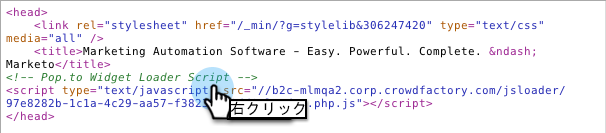

# Web サイトへのソーシャルのデプロイ {#deploy-social-on-your-website}

ソーシャルアプリを Marketo 以外のページに埋め込みます。

>[!AVAILABILITY]
>
>詳しくは、セールス担当者にお問い合わせください。

オーディエンスを魅了し、誰もがソーシャルネットワーク上のより大きな会話に参加できるように、ソーシャルアプリを独自の Web サイトにデプロイできます。ユーザーがソーシャルネットワーク上でプロモーションやコンテンツを友達と共有すると、サイト上でより多くのトラフィックが生成されます。

1. YouTube ビデオやソーシャルボタンなど、承認されたソーシャルアプリを選択します。

   

1. 「ソーシャルアプリのアクション」から「**埋め込みコード**」を選択します。

   

1. サイトのページヘッダー（`<head>`）と本文（`<body>`）のコードをコピーします。

   

1. Web サイトのページヘッダーに、最初のコードスニペットを貼り付けます。

   

1. ソーシャルアプリを表示したい各ページに、2 番目のコードスニペットを貼り付けます。

   

1. ソーシャルアプリのサイズをページ上の特定のディメンションに設定する必要がある場合は、2 番目のコードスニペットに **outerHeight** および **outerWidth** オプションを追加します。例えば、次のように `options='{"outerHeight":400, "outerWidth":600}'` を追加できます。

   

   Marketo ソーシャルアプリによって Web サイトにコンテンツとインタラクティビティが追加され、ファン、訪問者および既存の顧客による自社に関する情報の拡散が促進されます。同時に、プロファイルデータをデータベースに追加して、ソーシャルインフルエンス指標をトラッキングします。

   >[!MORELIKETHIS]
   >
   >* [ソーシャルアプリボタンのカスタマイズ](/help/marketo/product-docs/demand-generation/social/configuring-social-actions/customize-social-app-button.md)
   >* [ソーシャル共有要件の設定](/help/marketo/product-docs/demand-generation/social/social-functions/set-social-share-requirement.md)
   >* [ランディングページの Facebook への公開](/help/marketo/product-docs/demand-generation/facebook/publish-landing-pages-to-facebook.md)

