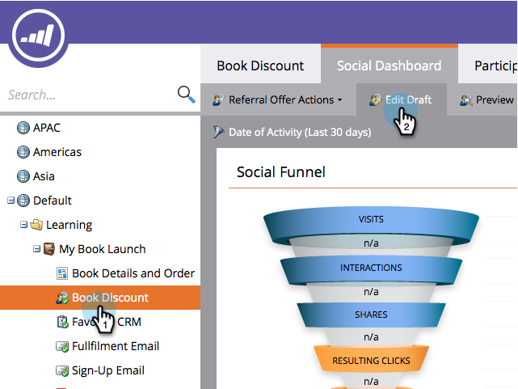

# ソーシャルシェアの要件を設定 {#set-social-share-requirement}

参照オファーを [作成する場合](../../../../product-docs/demand-generation/social/referral-offers/create-a-referral-offer.md)、登録またはオプションにするために、オファーの共有をユーザーに要求することができます。

>[!NOTE]
>
>**FYI**
>
>Marketoは現在、すべての購読で言語を標準化しているので、購読およびdocs.marketo.comの人物/人物にリード/リードを表示できます。 これらの用語は同じことを意味し、記事の説明には影響しません。 他にも変化がある。 [詳細情報](http://docs.marketo.com/display/DOCS/Updates+to+Marketo+Terminology)。

1. 「 **マーケティングアクティビティ**」に移動します。

   

1. 照会オファーを選択し、「ドラフトを **編集**」をクリックします。

   

1. 照会オファーエディターで、「 **アプリ設定** 」、「 **サインアップフロー手順**」の順に移動します。

   

1. 入会フローの順序を選択します。

   

   * **人物獲得/共有**:ユーザーは共有をスキップしてサインアップすることができます。
   * **共有/人物キャプチャ**:入会するには、ユーザーが共有する必要があります。

1. 各オプションについては、 **表示と編集ウィンドウのプレビューを参照してください** 。

   

