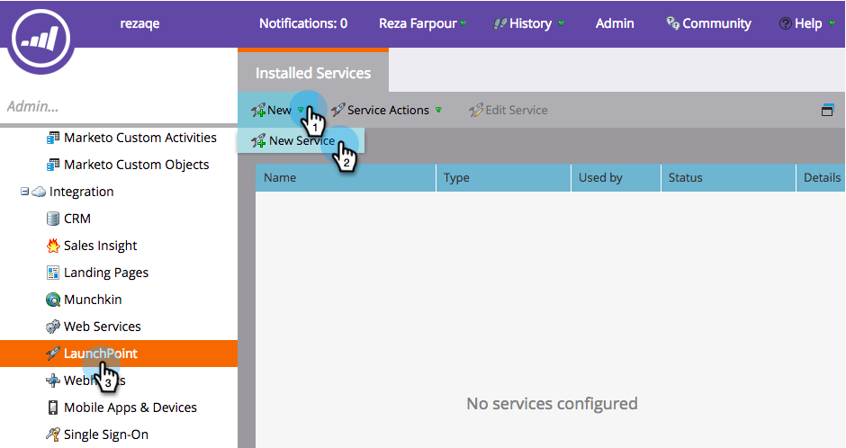
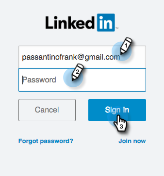
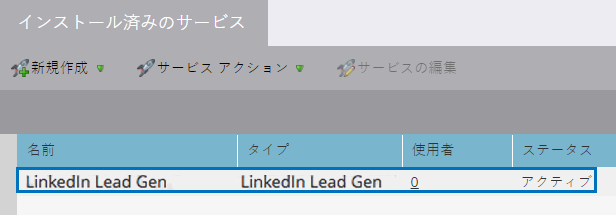

# LinkedInリードジェンFormsの設定 {#set-up-linkedin-lead-gen-forms}

LinkedInリードジェネレーションFormsを使用して、LinkedInで広告キャンペーンを実行し、Marketoのリードを生成します。

>[!NOTE]
>
>**管理者権限が必要**

1. Marketo **管理者**.

   

1. に移動します。 **LaunchPoint**&#x200B;をクリックし、 **新規** を選択します。 **新しいサービス**.

   

1. を入力します。 **表示名** サービスの **linkedIn Lead Gen** サービスをドロップダウンから選択し、「 **次へ**.

   

1. Marketoが同じブラウザーで新しいタブを開き、 [linkedin.com](https://www.linkedin.com). 統合に使用するアカウントを使用してLinkedInにログインします。

   >[!NOTE]
   >
   >LinkedInアカウントは、スポンサーキャンペーンを作成するすべてのLinkedInビジネスアカウントにアクセスできる必要があります。

   

1. LinkedInにログインした後、Marketoに戻って、「 **承認**.

   

1. プロンプトが表示されたら、 **許可** LinkedInへのMarketoアプリのインストールを受け入れる場合。

   

1. これで承認が完了しました。 「**次へ**」をクリックします。

   

   >[!CAUTION]
   >
   >このサービスは、認証後 1 年で自動的に期限切れになります。 再びアクセスするには、 **再認証**. ブラウザーの設定に応じて、LinkedInのパスワードを再入力する必要がある場合があります。

1. LinkedIn Lead Gen のリードをMarketoに表示するアカウントを選択し、「 **次へ**.

   >[!TIP]
   >
   >想定しているビジネスアカウントが表示されない場合は、承認されるユーザーのLinkedInアカウントに、LinkedInのビジネスアカウントに対する Lead Gen Form Manager 権限があることを確認してください。

   

1. デフォルトのLinkedInとMarketoのフィールドマッピングを受け入れるには、 **作成**. デフォルトのフィールドマッピングの変更、フィールドマッピングの削除、新しいフィールドマッピングの追加を行う場合は、以下のモーダルを通じて、フィールド単位でこれを行うことができます。

   >[!CAUTION]
   >
   >Marketoは、2 つのLinkedInフィールドの単一のMarketoフィールドへのマッピングをサポートしています。 **しかしただ** 2 つのLinkedInフィールドが同じフォーム上にない。 同じLinkedInフォームの 2 つのフィールドを 1 つのMarketoフィールドにマッピングすると、ユーザーはMarketoデータベースの入力に失敗する場合があります。

   

   >[!NOTE]
   >
   >既ににに保存されているLinkedInフィールドのみ [フォームテンプレート](https://www.linkedin.com/help/lms/answer/79634) LinkedIn Campaign Manager には、LinkedInフィールドとして表示され、Marketoフィールドにマッピングできます。

   

これで完了です。LinkedIn Lead Gen フォームを送信したユーザーは、LinkedIn側でキャンペーンを成功に導くと、Marketoに流れ込みます。

>[!NOTE]
>
>認証できるのは、1 つのLinkedInユーザーアカウントのみです。 Marketoにリンクする複数のビジネスアカウントがある場合は、承認されるユーザーのLinkedInアカウントに、LinkedInのビジネスアカウントに対するリード Gen Form Manager の権限があることを確認します。

>[!MORELIKETHIS]
>
>[スマートキャンペーンでのLinkedInリードジェネレーションフォームのフィルターとトリガーの使用](/help/marketo/product-docs/demand-generation/social/social-functions/use-linkedin-lead-gen-form-filters-and-triggers-in-a-smart-campaign.md)
