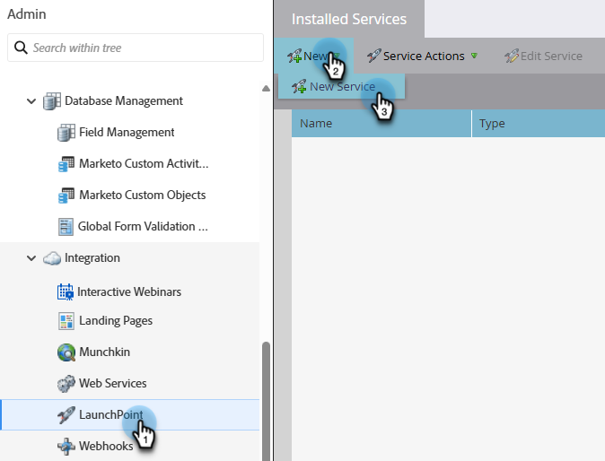
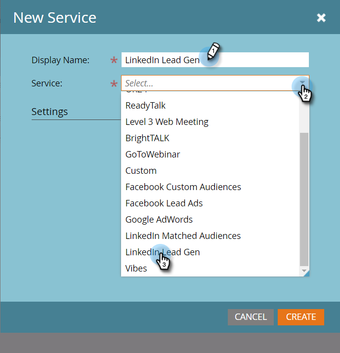
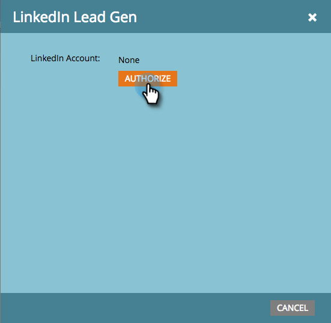
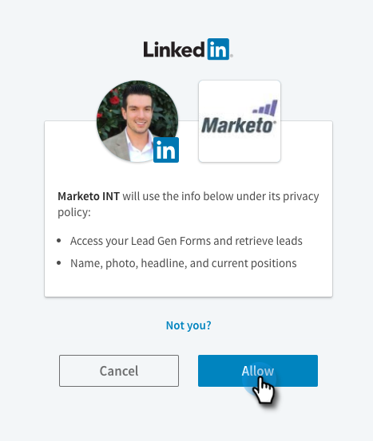
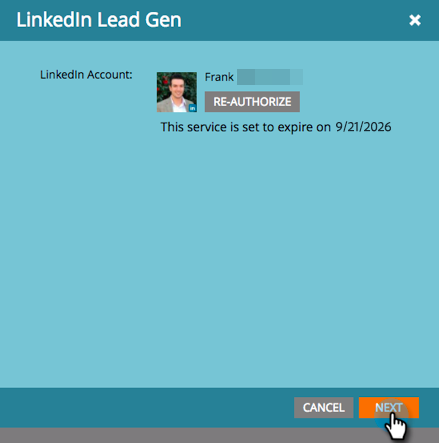
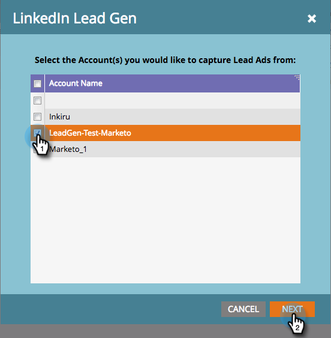
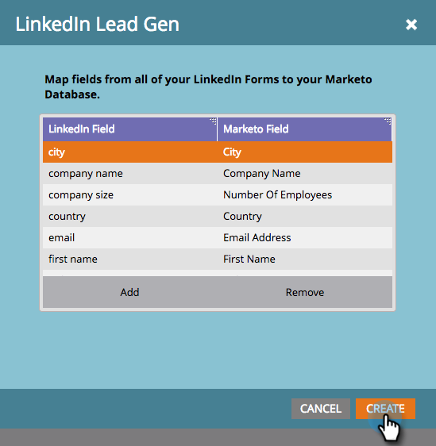
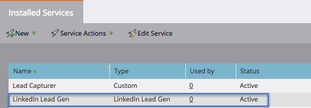

# LinkedIn リード生成フォームの設定 {#set-up-linkedin-lead-gen-forms}

LinkedIn リード生成フォームを使用して、LinkedIn で広告キャンペーンを実行し、Marketo のリードを生成します。

>[!NOTE]
>
>* **管理者権限が必要**
>
>* LinkedIn リードジェネレーションフォームを作成する際には、フォーム名に数字以外の文字が含まれていないことを確認してください。 フォーム名はアルファベットまたは英数字にする必要があります。
>
>* LinkedIn リードは、会社 API を使用して作成された会社レコードに関連付けられている Marketo の既存の個人レコードと一致し、Marketo サブスクリプションが CRM に接続されていない場合、Marketo Engage に組み込まれません。

1. 「**[!UICONTROL 管理者]**」領域に移動します。

   

1. **[!UICONTROL LaunchPoint]** に移動します。「**[!UICONTROL 新規]**」をクリックして、「**[!UICONTROL 新規サービス]**」を選択します。

   

1. サービスの&#x200B;**[!UICONTROL 表示名]**&#x200B;を入力し、ドロップダウンから「**[!UICONTROL LinkedIn リード生成]**」サービスを選択し、「**[!UICONTROL 次へ]**」をクリックします。

   

1. Marketo は同じブラウザーで新しい [linkedin.com](https://www.linkedin.com){target="_blank"} タブを開きます。 統合に使用するアカウントを使用して LinkedIn にログインします。

   >[!NOTE]
   >
   >LinkedIn アカウントは、スポンサーキャンペーンを作成するすべての LinkedIn ビジネスアカウントにアクセスできる必要があります。

   

1. LinkedInにログインしたら、Marketoに戻り、**[!UICONTROL Authorize]**&#x200B;をクリックします。

   

1. プロンプトが表示されたら、「**[!UICONTROL 許可]**」をクリックして、LinkedIn への Marketo アプリケーションのインストールを受け入れます。

   

1. 承認されたことに気づきます。 「**[!UICONTROL 次へ]**」をクリックします。

   

   >[!CAUTION]
   >
   >サービスの有効期限は、認証後 1 年で自動的に切れます。 アクセス権を取り戻すには、**[!UICONTROL 再認証]**&#x200B;をクリックします。 ブラウザーの設定に応じて、LinkedIn のパスワードを再入力する必要が生じる場合があります。

1. LinkedIn リード生成のリードを Marketo に表示させるアカウントを選択し、「**[!UICONTROL 次へ]**」をクリックします。

   >[!TIP]
   >
   >想定しているビジネスアカウントが表示されない場合は、許可されているユーザーのLinkedIn アカウントに、LinkedInのビジネスアカウントに対するリードジェネレーションフォームマネージャー権限があることを確認してください。

   

1. デフォルトのLinkedInからMarketoへのフィールドマッピングを受け入れるには、**[!UICONTROL 作成]**&#x200B;をクリックします。 デフォルトのフィールドマッピングの変更、フィールドマッピングの削除、新しいフィールドマッピングの追加をおこなう場合は、以下のモーダルを通じて、フィールド単位でこれを実行できます。

   >[!CAUTION]
   >
   >Marketo は、2 つの LinkedIn フィールドの単一の Marketo フィールドへのマッピングをサポートしています。_ただし_、2 つの LinkedIn フィールドが同じフォーム上にないときに限ります。 同じ LinkedIn フォームの 2 つのフィールドを 1 つの Marketo フィールドにマッピングした場合、Marketo データベースにユーザーが入力されないことがあります。

   

   >[!NOTE]
   >
   >LinkedIn Campaign Manager の[フォームテンプレート](https://www.linkedin.com/help/lms/answer/79634){target="_blank"}にすでに保存されている LinkedIn フィールドのみが、Marketo フィールドにマップできる LinkedIn フィールドとして表示されます。

   

LinkedIn リード生成フォームを送信するユーザーは、LinkedIn 側でキャンペーンを正常に実行すると、Marketo に入力されます。

>[!NOTE]
>
>1 つの LinkedIn ユーザーアカウントのみを認証できます。 Marketo にリンクする複数のビジネスアカウントがある場合は、許可されているユーザーの LinkedIn アカウントに、LinkedIn のビジネスアカウントに対するリード生成フォームマネージャー権限があることを確認してください。

>[!MORELIKETHIS]
>
>[スマートキャンペーンでの LinkedIn リード生成フォームのフィルターとトリガーの使用](/help/marketo/product-docs/demand-generation/social/social-functions/use-linkedin-lead-gen-form-filters-and-triggers-in-a-smart-campaign.md){target="_blank"}
