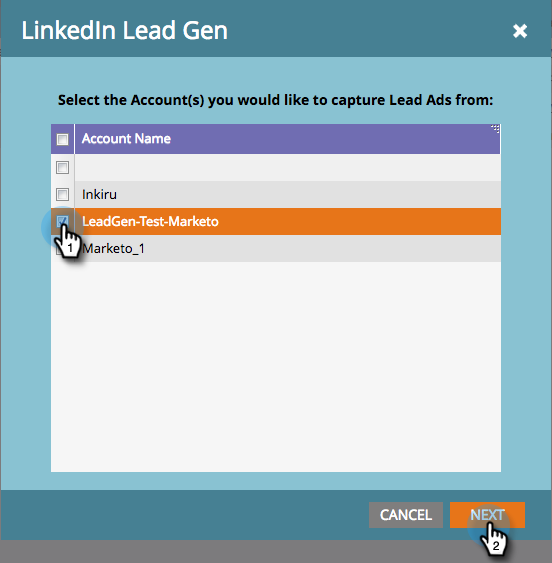

# LinkedIn リード生成フォームの設定 {#set-up-linkedin-lead-gen-forms}

LinkedIn リード生成フォームを使用して、LinkedIn で広告キャンペーンを実行し、Marketo のリードを生成します。

>[!IMPORTANT]
>
>LinkedIn では、Marketo Engage LinkedIn 統合で使用されるマーケティング API をアップグレードしています。この変更により、サービスの中断を避けるために、2024年6月7日（PT）から 12月15日（PT）までの間、**管理**／**LaunchPoint** メニューですべての LinkedIn LaunchPoint サービスの再認証が必須になります。詳しくは、[移行に関する FAQ](https://nation.marketo.com/t5/employee-blogs/linkedin-re-authentication-required/ba-p/347794){target="_blank"} を参照してください。

>[!NOTE]
>
>**管理者権限が必要**

>[!NOTE]
>
>LinkedIn リードは、会社 API を使用して作成された会社レコードに関連付けられている Marketo の既存の個人レコードと一致し、Marketo サブスクリプションが CRM に接続されていない場合、Marketo Engage に組み込まれません。

1. 「**[!UICONTROL 管理者]**」領域に移動します。

   

1. **[!UICONTROL LaunchPoint]** に移動します。「**[!UICONTROL 新規]**」をクリックして、「**[!UICONTROL 新規サービス]**」を選択します。

   

1. サービスの&#x200B;_表示名_&#x200B;を入力し、ドロップダウンから「**[!UICONTROL LinkedIn リード生成]**」サービスを選択し、「**[!UICONTROL 次へ]**」をクリックします。

   

1. Marketo は同じブラウザーで新しい [linkedin.com](https://www.linkedin.com){target="_blank"} タブを開きます。統合に使用するアカウントを使用して LinkedIn にログインします。

   >[!NOTE]
   >
   >LinkedIn アカウントは、スポンサーキャンペーンを作成するすべての LinkedIn ビジネスアカウントにアクセスできる必要があります。

   

1. LinkedIn にログインした後、Marketo に戻り、「**[!UICONTROL 許可]**」をクリックします。

   

1. プロンプトが表示されたら、「**[!UICONTROL 許可]**」をクリックして、LinkedIn への Marketo アプリケーションのインストールを受け入れます。

   

1. これで、権限が与えられたことに気が付くでしょう。「**[!UICONTROL 次へ]**」をクリックします。

   

   >[!CAUTION]
   >
   >サービスの有効期限は、認証後 1 年で自動的に切れます。アクセスを再開するには、「**[!UICONTROL 再認証]**」をクリックするだけです。ブラウザーの設定に応じて、LinkedIn のパスワードを再入力する必要が生じる場合があります。

1. LinkedIn リード生成のリードを Marketo に表示させるアカウントを選択し、「**[!UICONTROL 次へ]**」をクリックします。

   >[!TIP]
   >
   >予期するビジネスアカウントが表示されない場合は、許可されているユーザーの LinkedIn アカウントに、LinkedIn のビジネスアカウントに対するリード生成フォームのマネージャー権限があることを確認してください。

   

1. デフォルトの LinkedIn から Marketo へのフィールドマッピングを受け入れるには、「**[!UICONTROL 作成]**」をクリックします。デフォルトのフィールドマッピングの変更、フィールドマッピングの削除、新しいフィールドマッピングの追加をおこなう場合は、以下のモーダルを通じて、フィールド単位でこれを実行できます。

   >[!CAUTION]
   >
   >Marketo は、2 つの LinkedIn フィールドの単一の Marketo フィールドへのマッピングをサポートしています。_ただし_、2 つの LinkedIn フィールドが同じフォーム上にないときに限ります。同じ LinkedIn フォームの 2 つのフィールドを 1 つの Marketo フィールドにマッピングした場合、Marketo データベースにユーザーが入力されないことがあります。

   

   >[!NOTE]
   >
   >LinkedIn Campaign Manager の[フォームテンプレート](https://www.linkedin.com/help/lms/answer/79634){target="_blank"}にすでに保存されている LinkedIn フィールドのみが、Marketo フィールドにマップできる LinkedIn フィールドとして表示されます。

   

これで完了です。LinkedIn リード生成フォームを送信するユーザーは、LinkedIn 側でキャンペーンを正常に実行すると、Marketo に入力されます。

>[!NOTE]
>
>1 つの LinkedIn ユーザーアカウントのみを認証できます。Marketo にリンクする複数のビジネスアカウントがある場合は、許可されているユーザーの LinkedIn アカウントに、LinkedIn のビジネスアカウントに対するリード生成フォームマネージャー権限があることを確認してください。

>[!MORELIKETHIS]
>
>[スマートキャンペーンでの LinkedIn リード生成フォームのフィルターとトリガーの使用](/help/marketo/product-docs/demand-generation/social/social-functions/use-linkedin-lead-gen-form-filters-and-triggers-in-a-smart-campaign.md){target="_blank"}
