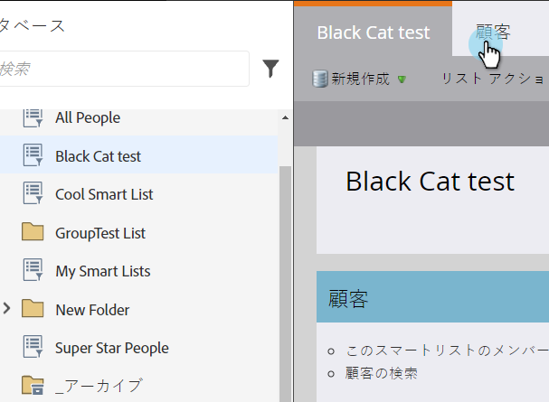
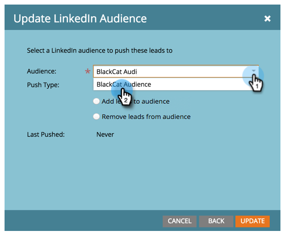

# LinkedInオーディエンスセグメントとしてのMarketoリストまたはスマートリストの使用{#use-a-marketo-list-or-smart-list-as-a-linkedin-audience-segment}

マーケティング担当者をLinkedInオーディエンスと統合します。

>[!PREREQUISITES]
>
>* [LaunchPointサ追加ービスとしての一致したオーディエンスのLinkedIn](../../../../product-docs/demand-generation/ad-network-integrations/add-linkedin-matched-audiences-as-a-launchpoint-service.md)

>

1. 「**データベース**」に移動します。

   

1. スマートリストを選択します。

   

1. 「**ユーザー**」タブをクリックします。

   

1. リストの下部にある「** Send Via Ad Bridge **icon 」をクリックします。

   

   >[!NOTE]
   >
   >広告ネットワーク統合を使用してLinkedInにオーディエンスを送信する場合、Marketorは電子メールアドレスのみを送信します。

1. 「** LinkedIn**」を選択し、「**次へ**」をクリックします。

   

1. **LinkedInオーディエンス**&#x200B;を選択します。

   >[!NOTE]
   >
   >「**+新規オーディエンス**」をクリックすると、LinkedInキャンペーンマネージャーにオーディエンスが作成されます。

   

   >[!NOTE]
   >
   >LinkedInは、2018年3月に「オーディエンスをクリアし、リードを追加」プッシュタイプに使用されるAPIを非推奨となりました。 このオプションは、Marketorの2018年第1四半期リリースではご利用いただけません。

1. **プッシュタイプ**&#x200B;を選択します。 「**更新**」をクリックします。

   

   >[!NOTE]
   >
   >同期が行われるまで15分お待ちください。

   [LinkedInのマーケティングソリューションヘルプセンター](https://www.linkedin.com/help/lms/answer/73938?query=ad%20segment)

ハイフィーブ！ データは、LinkedInのオーディエンスと一致するようになります。 アカウントと連絡先のターゲット設定用にLinkedInにリストをアップロードする方法については、を参照してください。