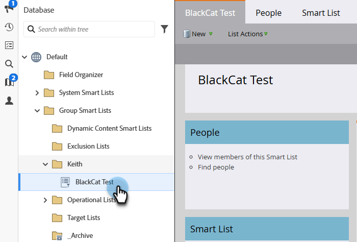
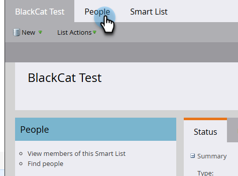
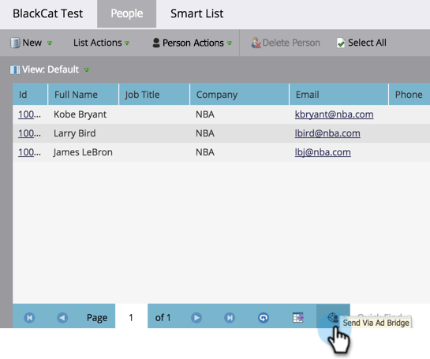
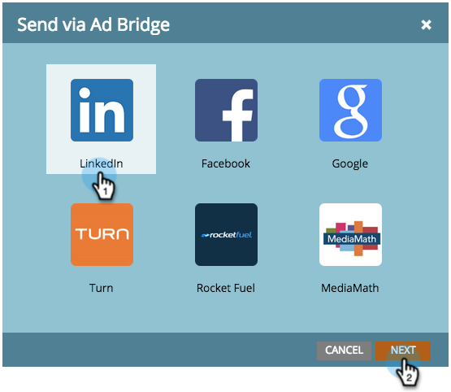
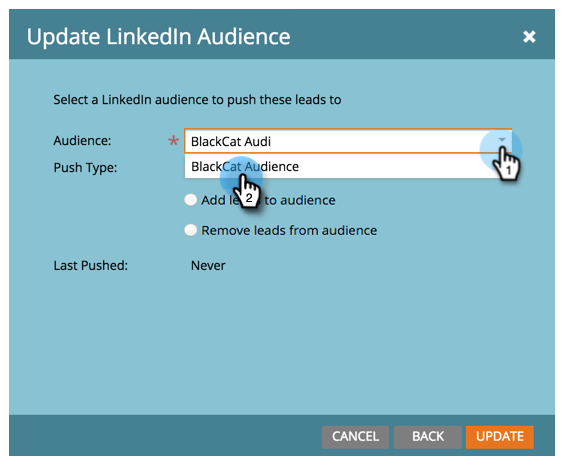
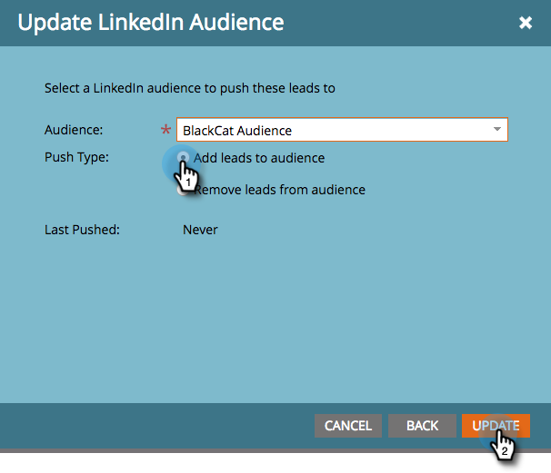

# LinkedIn のオーディエンスセグメントとしての Marketo リストまたはスマートリストの使用 {#use-a-marketo-list-or-smart-list-as-a-linkedin-audience-segment}

Marketo Engage の人物を LinkedIn のオーディエンスと統合します。

>[!PREREQUISITES]
>
>[LinkedIn と一致したオーディエンスを LaunchPoint サービスとして追加](/help/marketo/product-docs/demand-generation/ad-network-integrations/add-linkedin-matched-audiences-as-a-launchpoint-service.md){target="_blank"}

1. **[!UICONTROL データベース]**&#x200B;に移動します。

   

1. スマートリストを選択します。

   

1. 「**[!UICONTROL リード]**」タブをクリックします。

   

1. リストの下部にある **[!UICONTROL Ad Bridge 経由で送信]**&#x200B;アイコンをクリックします。

   

   >[!NOTE]
   >
   >広告ネットワーク統合を使用してオーディエンスを LinkedIn に送信する場合、Marketo はメールアドレスのみを送信します。

1. 「**[!UICONTROL LinkedIn]**」を選択し、「**[!UICONTROL 次へ]**」をクリックします。

   

1. **[!UICONTROL LinkedIn オーディエンス]**&#x200B;を選択します。

   >[!NOTE]
   >
   >「**[!UICONTROL +新規オーディエンス]**」をクリックすると、LinkedIn Campaign Manager でオーディエンスが作成されます。

   

   >[!NOTE]
   >
   >LinkedIn は、2018年3月に「オーディエンスの消去とリードの追加」プッシュタイプに使用される API を非推奨（廃止予定）にしました。 このオプションは、Marketo の 2018 年第 1 四半期リリース以降は使用できなくなりました。

1. **[!UICONTROL プッシュタイプ]**&#x200B;を選択します。 「**[!UICONTROL 更新]**」をクリックします。

   

   >[!NOTE]
   >
   >同期が完了するまでに15分かかります。

これで、データはLinkedInのオーディエンスと同期されます。 アカウントおよび連絡先のターゲティング用に LinkedIn にリストをアップロードする方法については、[LinkedIn Marketing Solutions ヘルプセンター](https://www.linkedin.com/help/lms/answer/73938?query=ad%20segment){target="_blank"}にアクセスしてください。
