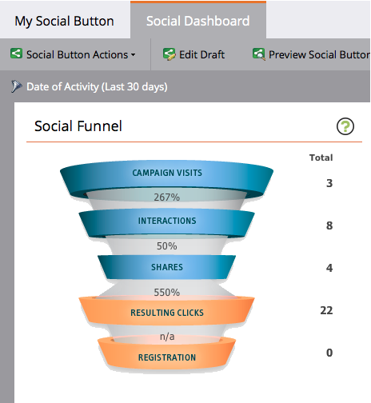

# ソーシャルパフォーマンスの表示 {#view-social-performance}

ソーシャルアプリで生成されたソーシャルアクティビティを表示します。Social ダッシュボードでは、ソーシャルアプリによって発生する様々なソーシャルインタラクションに関するインサイトを得て、ソーシャルアプリのパフォーマンスを追跡できます。

>[!AVAILABILITY]
>
>すべてのお客様がこの機能を購入しているわけではありません。詳細は、営業取引先責任者にお問い合わせください。

1. **マーケティングアクティビティ**&#x200B;に移動します。

   

1. ソーシャルアプリを選択します。

   

1. 「**アクティビティ日**」をクリックします。

   

1. 間隔を選択します。

   

   >[!NOTE]
   >
   >「**過去 24 時間**」を選択した場合、1 時間ごとの指標が、毎時 00 分に計算されます。その他すべての間隔では、指標は毎日午前 0 時に実行されます。

1. **ソーシャルファネル**&#x200B;を使用して、ソーシャルメディアにおけるプロモーションの進行状況と効果を確認します。

   * **キャンペーン訪問**：ソーシャルアプリを含むページを、見込み客が読み込んだ回数。
   * **インタラクション**：[紹介オファー](/help/marketo/product-docs/demand-generation/social/referral-offers/create-a-referral-offer.md)への新規登録、[投票](/help/marketo/product-docs/demand-generation/social/creating-a-poll/create-a-poll.md)への参加、[ビデオの共有](/help/marketo/product-docs/demand-generation/landing-pages/free-form-landing-pages/add-a-video-to-a-free-form-landing-page.md)など、見込み客がソーシャルアプリで何らかの操作をおこなった回数。
   * **共有**：見込み客がソーシャルアプリからソーシャルネットワークにメッセージを共有した回数。
   * **結果クリック数**：ソーシャルアプリから見込み客が共有のリンクをクリックした回数。
   * **登録**：アプリへの共有リンクをたどった後、プロモーションに新規登録する見込み客の数。

   >[!NOTE]
   >
   >複数のソーシャルアプリを使用したページへの訪問は、各アプリごとに 1 回の訪問としてカウントされます。同じアプリ内での複数のページへの訪問は 1 回の訪問としてカウントされます。30 分以上経ってからの訪問やブラウザーの再起動後の訪問は、新規としてカウントされます。

   

1. **オーディエンス**&#x200B;パネルを使用して、見込み客が発信にどう役立っているかを確認します。

   * **合計プロファイル数**：ソーシャルアプリからソーシャルネットワークにログインした見込み客の合計数。
   * **インフルエンサー**：アプリ共有から少なくとも 1 回のクリックが発生した見込み客の数。
   * **ソーシャルリーチ**：すべての見込み客の接続の合計。ソーシャルネットワークと共有する見込み客の場合、ソーシャルアプリから共有した時点での友達の数を表します。メール共有の場合、アプリから生成されるメールの受信者数です。
   * **ソーシャルインプレッション**：見込み客の接続のフィードにソーシャルアプリが表示された回数の合計。

   

1. **指標の共有**&#x200B;パネルを使用して、ソーシャルアプリで生成されたソーシャルアクティビティの集計を確認します。

   * **共有率**：共有を生成するアプリへの訪問の割合。
   * **クリックバック率**：共有 1 回あたりのクリック数。
   * **ソーシャルでの上昇率**：（共有のリンクからの）アプリへの訪問の割合とソーシャル以外（ソーシャルアプリ以外のソースから）の訪問の数の割合。

   

>[!MORELIKETHIS]
>
>また、トリガーやフィルターを使用して、コンテンツを共有しているユーザーやソーシャルアプリとのインタラクションを確認し、それらのインタラクションに対処することもできます。[ソーシャルアクティビティのトリガーとフィルターの使用](/help/marketo/product-docs/demand-generation/social/social-functions/triggers-and-filters-for-social-activities.md)を参照してください。
