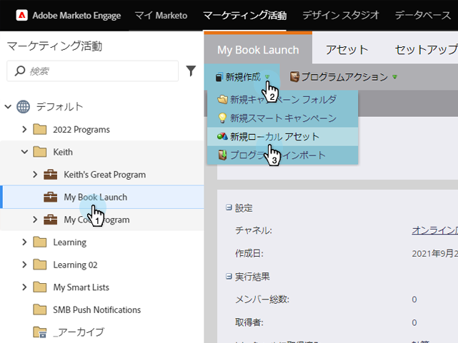

# 懸賞の作成{#create-sweepstakes}

懸賞は、友達にあなたのことを話す代わりに、賞を取る機会を与えてくれます。 ランディングページやWebサイト、さらにはFacebookにも投稿できます。

>[!NOTE]
>
>**可用性**
>
>この機能を購入していないお客様もいます。 詳細については、セールス担当者にお問い合わせください。

1. プログラム内で、**新規/新規ローカルアセット**&#x200B;を選択します。

   

1. ローカルアセットギャラリーで、**懸賞**&#x200B;をクリックします。

   

1. 懸賞の名前を指定します。

   

   >[!TIP]
   >
   >時間を節約するために、「**Clone From**」オプションを使用して、既存の懸賞のすべての設定をコピーできます。

1. 「**懸賞** **詳細**」をクリックします。

   

1. 頻度、開始日、終了日、タイムゾーンを選択します。

   

   >[!NOTE]
   >
   >日別の図面と週別の図面の場合、開始と終了時間はそれぞれ午前12時と午後11時59分に固定されます。 1回限りの図面の場合は、独自の開始と終了時間を選択できます。

1. 「**詳細** **オプション**」をクリックします。

   

1. 懸賞追加のルールへのリンクです。 URLを入力します。 このリンクは必須です。

   

   共有メッセージ画面の下部にリンクが表示されます。

   >[!NOTE]
   >
   >この画面で、プライバシーポリシーリンクを追加することもできます。 「[Socialアプリに対するプライバシーポリシー追加](../../../../product-docs/demand-generation/social/social-functions/add-your-privacy-policy-to-a-social-app.md)」を参照してください。

1. 「**完了**」をクリックします。

   

1. 「**承認** **」および「** **閉じる**」をクリックします。

   

   >[!TIP]
   >
   >懸賞のデフォルト値を変更するには、[**戻る**]をクリックします。 承認せずに後で作業を保存するには、[**閉じる**]をクリックします。

   おめでとう！ 懸賞が作成されました。

   >[!NOTE]
   >
   >**関連記事**
   >
   >次の手順は、[懸賞](publish-a-sweepstakes.md)を公開することですが、懸賞の外観と設定は変更できます。 [懸賞のスタイルのカスタマイズ](customize-sweepstakes-styles.md)との開始

懸賞エディターが新しいウィンドウで開きます。 デフォルトの設定は問題ありませんが、いくつかの詳細を設定する必要があります。 次の手順を説明します。                    懸賞に問題がある場合は、懸賞が承認される前に、その問題に対処するよう求められます。