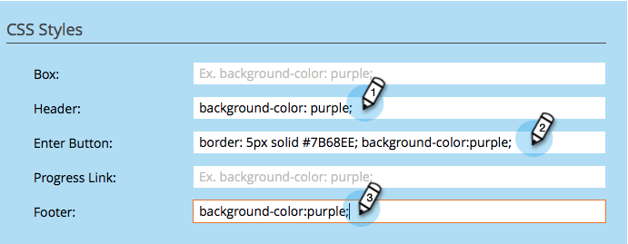

# 懸賞のスタイルのカスタマイズ {#customize-sweepstakes-styles}

懸賞を [作成する際に](create-sweepstakes.md)、ランディングページ上での懸賞の外観をカスタマイズできます。

>[!NOTE]
>
>**可用性**
>
>この機能を購入していないお客様もいます。 詳細については、セールス担当者にお問い合わせください。

1. 「マーケティングアクティビティ」に移動します。

1. 懸賞を選択し、「 **ドラフトを** 編集 ****」をクリックします。

   

1. Sweepstakesエディターで、 **App** Settings **/** Appearance **Settings(アプリ** 設定 **/**&#x200B;外観)に移動します。

   

1. サインアップボタンのテキストと進行状況リンクを編集します。
1. 

1. カスタマイズする要素ごとに、カスタムCSSプロパティを入力します。

   

   Enter **Button**：のCSSの例
   `<pre>border: 5px solid #7B68EE; background-color: purple; padding: 10px; font: 16px; color: #FFFFFF; text-align: center;</pre>` 画像の **入力ボタン**:
   `<pre>background:url(http://app.marketo.com/images/public-site/button_sign-up-now.png) no-repeat center center; width:275px; height:95px; margin:auto; display:block;</pre>` `<pre>`

   >[!NOTE]
   >
   >テキストが含まれた画像を使用する場合は、上の「テキスト」の下の「 **Enter** **Button ***」フィールドからテキストを削除することを忘れないでください。

1. 変更を行うたびに、結果が表示と編集プレビューに表示されます。

   

   >[!NOTE]
   >
   >**Reminder**
   >
   >
   >古いバージョンを含む様々なブラウザーでボタンをテストします。

   >[!NOTE]
   >
   >**関連記事**
   >
   >
   >次の手順は、 [サインアップ電子メールと受渡通知電子メールを懸賞に追加することで](../../../../product-docs/demand-generation/social/social-functions/use-emails-in-social-promotions.md)す。

