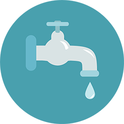

# メールマーケティング {#email-marketing}

デスクトップ、タブレット、携帯電話のいずれにメールを送信する場合でも、Marketo が対応しています。
**一般メールマーケティング** [一般メールマーケティングすべてのことメール。 Woo hoo!](https://docs.marketo.com/display/DOCS/General)     **電子メールプログラム** [電子メールプログラム A/B テストと、シンプルな4 クリックウィザードでの爆発](https://docs.marketo.com/display/DOCS/Email+Programs)     ** ドリップナーチャリング** [&#x200B; ドリップナーチャリング強力なエンゲージメントプログラムを使用して、コンテンツストリームとケイデンスを設定します。](https://docs.marketo.com/display/DOCS/Drip+Nurturing)
