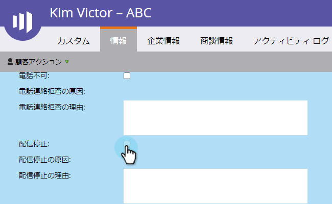
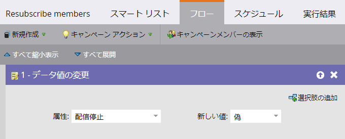

# 永続的な登録解除{#durable-unsubscribe}

Marketorは、購読解除機能の動作を強化し、「耐久性」を向上しました。 マスター電子メールのステータスが追加されました。これは、個人の詳細レコードに表示される登録解除フラグとは別のものです。

unsubscribeフラグがfalseからtrueに設定されている場合、マスター電子メールのステータスが更新され、変更が同じ電子メールアドレスを持つ他のユーザーに反映されます。 ユーザーが削除されて再作成された場合、または同じ電子メールアドレスを使用して新しいレコードが作成された場合、登録解除フラグは&#x200B;**上書きされません**。

>[!NOTE]
>
>永続的な登録解除は、Marketoデータベース全体のすべてのパーティションで機能します。

## UnsubscribeフラグをTrueからFalseに更新する（例： Re-subscribe a Person）{#update-the-unsubscribe-flag-from-true-to-false-e-g-re-subscribe-a-person}

登録を再登録する方法はいくつかあります。

Salesforceでは、リード/連絡先のレコードの電子メールオプトアウトフィールドを&#x200B;**クリア**&#x200B;します。 これはMarketoと同期されます。

Marketoで、ユーザーのレコードの「情報」タブの&#x200B;**登録解除ボックスを**&#x200B;クリアします。

以下に示すように、1人または複数のユーザーに対して&#x200B;**データ値の変更**&#x200B;のフローステップを実行します。

SOAP APIを使用して既存のユーザーを更新します。

## 新しい人の作成{#creating-a-new-person}

新しいユーザーが作成されると、Marketorはそのユーザーをマスター電子メールステータステーブルと照合してチェックします。 既に登録が取り消されていた場合は、登録を取り消すレコードを更新します。

## 電子メールアドレスの変更{#changing-an-email-address}

ユーザーの電子メールアドレスを登録解除された電子メールアドレスに変更すると、そのユーザーは登録解除されます。 この変更は、MarketorまたはSalesforceで発生できます。

登録解除された電子メールアドレスを、登録解除された電子メールアドレスに変更すると、そのユーザーは登録されます。

## 再登録{#re-subscribing}

登録解除すると、同じ電子メールアドレスを持つすべてのユーザーが登録解除されるのと同じように、再登録すると、実際には同じ電子メールアドレスを持つすべてのユーザーが再登録されます。

## アクティビティログ{#activity-log}

_updateLeadEmailStatus_&#x200B;と&#x200B;_resetLeadEmailStatus_&#x200B;のデータ値の変更定義は、[このコミュニティの記事](http://nation.marketo.com/t5/Knowledgebase/Durable-Unsubscribe-Activity-Log/ta-p/252688)に記載されています。

>[!MORELIKETHIS]
>
>[登録解除](/help/marketo/product-docs/email-marketing/deliverability/understanding-unsubscribe.md)
