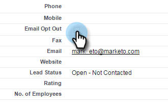
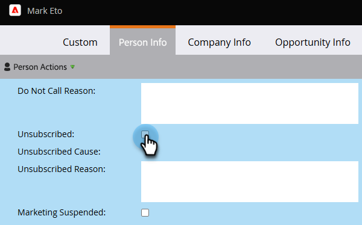
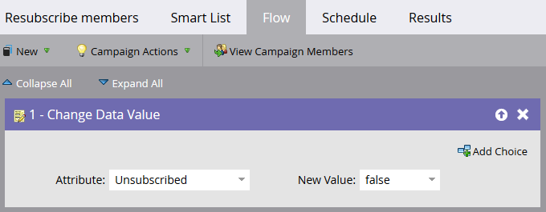

# 永続的な登録解除 {#durable-unsubscribe}

Marketo で購読解除が「永続的」になるように、機能が強化されました。 マスターメールのステータスが追加されました。これは、人物の詳細レコードに表示される購読解除フラグとは別のものです。

購読解除フラグを false から true に変更すると、マスターメールステータスが更新され、その変更は同じメールアドレスを持つ他の人物にも反映されます。 リードが削除されて再作成されるとき、または新規レコードが同じメールアドレスで作成されるとき、登録解除フラグは&#x200B;**上書きされません**。

>[!NOTE]
>
>永続的な購読解除は、Marketo データベース全体のすべてのパーティションで機能します。

## 購読解除フラグを true から false に更新（人物を再購読登録） {#update-the-unsubscribe-flag-from-true-to-false-e-g-re-subscribe-a-person}

リードを再度配信登録するには、いくつかの方法があります。

Salesforce では、リード／取引先責任者のレコードにある「メールオプトアウト」フィールドをクリアします。 これで Marketo に同期されます。

Marketo では、人物のレコードの「情報」タブにある購読解除ボックスをオフにします。

1 つまたは複数のユーザで、「**[!UICONTROL データ値を変更]**」フローステップを実行します。

## 新しい人物の作成 {#creating-a-new-person}

新しいリードを作成すると、マスターメールステータスのテーブルと照合されます。 以前に購読解除されていた場合、レコードは購読解除に更新されます。

## メールアドレスの変更 {#changing-an-email-address}

人物のメールアドレスを、購読解除されているメールアドレスに変更すると、その人物は購読解除になります。 この変更は、Marketo でも [!DNL Salesforce] でも発生します。

## 再度の配信登録 {#re-subscribing}

登録解除すると、同じメールアドレスを持つすべてのユーザーが登録解除されるのと同様に、再登録では、同じメールアドレスを持つすべてのユーザーが再度登録されます。

>[!MORELIKETHIS]
>
>[登録解除について](/help/marketo/product-docs/email-marketing/deliverability/understanding-unsubscribe.md)
