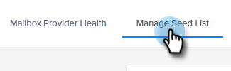
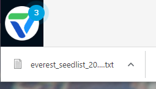

# メール到達率パワーパック：シードリストのインポート方法 {#email-deliverability-power-pack-how-to-import-a-seed-list}

シードリストは、Google Apps、Hotmail、Yahoo! など、複数のメールボックスプロバイダーに存在するメールアカウントのリストで、受信ボックスの到達率質とスパムフォルダーの到達率の比率を概算するために使用されます。 以下に、そのリストを Marketo Engage インスタンスに取得する手順を示します。

>[!IMPORTANT]
>
>この記事は、現時点でアクティブな Everest サブスクリプションを持つユーザ向けです。 Bird（旧称 MessageBird）によるインボックストラッカーを使用する場合は、[こちらの](/help/marketo/product-docs/email-marketing/deliverability/inbox-tracker/inbox-tracker-tutorials.md){target="_blank"}チュートリアルをご覧ください。

## シードリストのインポート {#import-a-seed-list}

1. My Marketo で、「**[!UICONTROL 配信ツール]**」を選択します。

   

1. [!DNL Everest] アプリケーションが開きます。 左側のナビゲーションで、「**[!UICONTROL フライト中]**」をクリックし、「**[!UICONTROL インボックスへの配置]**」を選択します。

   

1. 「**[!UICONTROL シードリストを管理]**」タブをクリックします。

   

1. **[!UICONTROL アクション]**&#x200B;ドロップダウンをクリックし、「**[!UICONTROL 1 行につき 1 件ダウンロード]**」を選択します。

   

   >[!NOTE]
   >
   >[!DNL Everest] でリストを最適化する場合は、（ページ上部にある）シードリストオプティマイザーを使用します。

1. 書き出し後、リストは txt ファイルとしてブラウザーのダウンロードフォルダーに表示されます。 取得し、静的リストとして Marketo インスタンスに[インポート](/help/marketo/getting-started/quick-wins/import-a-list-of-people.md)します。

   

   >[!TIP]
   >
   >リストには見つけやすいような名前を付けてください。

   >[!CAUTION]
   >
   >これらのインボックスへの配置キャンペーンの数は 1 か月あたりで制限されています。 数を確認するには、[!DNL Everest] の[!UICONTROL アカウント設定]／[!UICONTROL サブスクリプション]の下の「[!UICONTROL サブスクリプション]」セクションを参照してください。 詳細については、Marketo の営業担当にお問い合わせください。

## 新しいシードリストの取得 {#acquiring-new-seedlists}

シードリストは、毎月同じ頻度で変更される場合があります。 メール配信品質パワーパックに定期的にログインし、シードリストのステータスを確認することが重要です。 新しいアドレスが追加されたり、自分側でアップデートが必要な場合は、アプリケーションの左下にある通知アイコンでアラートが表示されます。

Marketo で静的リストを作成したら、そのリストへの送信を開始して、メールのインボックスへの配置をテストできます。
