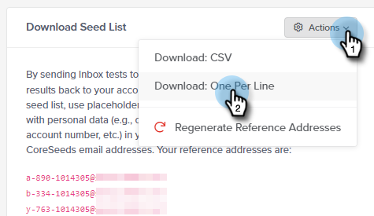
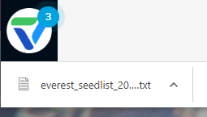

# メール到達率パワーパック：シードリストのインポート方法 {#email-deliverability-power-pack-how-to-import-a-seedlist}

シードリストは、Google Apps、Hotmail、Yahoo!など、複数のメールボックスプロバイダーに存在するメールアカウントのリストで、受信ボックスの到達率質とスパムフォルダーの到達率の比率を概算するために使用されます。このリストを Marketo インスタンスに取り込む方法を次に示します。

>[!AVAILABILITY]
>
>すべてのお客様がこの機能を購入しているわけではありません。詳細は、セールス担当者にお問い合わせください。

## シードリストのインポート {#import-a-seedlist}

1. マイMarketoで、 **配信ツール**.

   

1. Everest アプリケーションが開きます。 左側のナビゲーションで、 **飛行中** を選択し、 **インボックスの配置**.

   

1. 次をクリック： **シードリストを管理** タブをクリックします。

   

1. アクションドロップダウンをクリックし、「 」を選択します。 **1 行に 1 つダウンロード**.

   

   >[!NOTE]
   >
   >Everest でリストを最適化したい場合は、（ページ上部の）シードリストオプティマイザーを使用します。

1. エクスポート後、リストは txt ファイルとしてブラウザーのダウンロードフォルダーに表示されます。取得し、静的リストとして Marketo インスタンスに[インポート](/help/marketo/getting-started/quick-wins/import-a-list-of-people.md)します。

   

   >[!TIP]
   >
   >リストには見つけやすいような名前を付けてください。

   >[!CAUTION]
   >
   >1 ヶ月あたり、これらの受信ボックス配置キャンペーンの数は制限されます。 取得した購読の数を確認するには、Everest のアカウント設定/購読の下の購読セクションを参照してください。 詳細については、Marketo の営業担当にお問い合わせください。

## 新しいシードリストの取得 {#acquiring-new-seedlists}

シードリストは、毎月同じ頻度で変更される場合があります。メール到達率パワーパックに定期的にログインし、シードリストのステータスを確認することが重要です。新しいアドレスが追加されたり、自分側でアップデートが必要になったりした場合は、シードリストを取得ページのインターフェイスを通じてアラートが表示されます。

Marketo で静的リストを作成したら、そのリストへの送信を開始して、メールのインボックスへの配置をテストできます。
