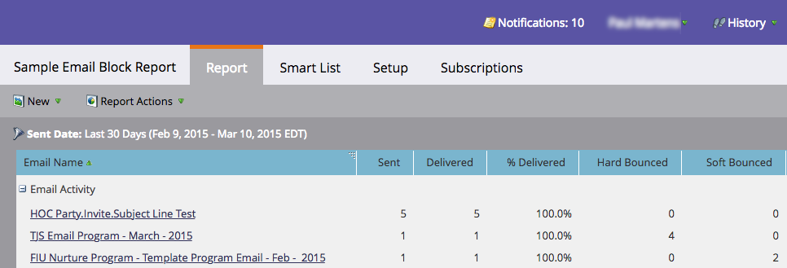

# メールのハードバウンスとソフトバウンス {#hard-and-soft-bounces-in-email}

ハードバウンスは、メールサーバーが Marketo に対し、その人物のメールを配信できないと通知したときに、その人物のメールアドレスが無効と見なされる状態を指します。 ソフトバウンスとは、電子メールを受信する際に何らかの問題が発生したことを意味します。この問題は自動的に解決され、数日かかることもあります。 ハードバウンスとソフトバウンスの両方が[複数のカテゴリ](https://nation.marketo.com/t5/Knowledgebase/Maintaining-a-Directory-of-Leads-Bouncing-Emails/ta-p/300838)で構成されます。

## バウンスの分類 {#bounce-classification}

Marketoには、問題のあるメール配信に関連する5つの人物フィールドがあります。

1. **メールの中断** - 特定のタイプのハードバウンスが発生したときに True に設定されます。
1. **メールの中断原因** - 考えられる原因は様々ですが、 このフィールドは原因を説明するためのものです。
1. **メールの中断時刻** - 原因となるバウンスが発生すると、Marketo はこのタイムスタンプから 24 時間にわたって当該リードへのメール送信を中断します。
1. **メール無効** - ハードバウンスが発生したときに True に設定されます。
1. **メール無効の理由** - ハードバウンスの理由です。

>[!NOTE]
>
>リードが「**メールの中断**」ステータスに達した後は、「メールの中断」チェックボックスをオフにする方法はありません。 ただし、最初の中断から 24 時間が経過すると、再び送信可能になります。
>
>ユーザーが&#x200B;**電子メールが無効**&#x200B;とマークされている場合、レコードの「ユーザー情報」タブの「電子メールが無効」ボックスのチェックを外して、手動でのみリセットできます（電子メールアドレスが有効であることを確認した場合にのみ推奨されます）。

>[!PREREQUISITES]
>
>[次の手順](/help/marketo/product-docs/email-marketing/email-programs/email-program-data/email-performance-report.md)に従って、メールパフォーマンスレポートを作成し、バウンスデータを生成します。

メールパフォーマンスレポートを作成した後、画面は次のようになります。

>[!NOTE]
>
>スパムフィルターによってハードバウンスが発生することがあります。 このような「偽陽性」は、その人物のメールアドレスが本当に有効かどうかを示すものではありません。
