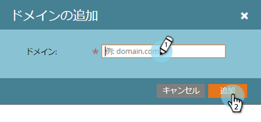

# カスタムDKIM署名の設定{#set-up-a-custom-dkim-signature}

最高の配信品質を確保するために、Marketo DKIMの共有署名を使用して、すべての送信メールに自動的に署名します。

>[!NOTE]
>
>この記事の手順の一部を完了するには、ITチームの支援が必要になる場合があります。

DKIM署名をパーソナライズして、選択したドメインを反映させることができます。 これが方法です。

1. **管理者**&#x200B;セクションに移動します。

   

   >[!NOTE]
   >
   >カスタムDKIM署名を古い方法で設定した場合、その署名は引き続き機能し、ここに表示されます。

1. 「**電子メール**」をクリックし、「**DKIM**」タブをクリックして、最後に「**追加ドメイン**」をクリックします。

   

1. Marketo Emailsで使用するドメインを「From Address」として入力し、**追加**&#x200B;をクリックします。

   >[!TIP]
   >
   >送信元アドレスで別のドメインを使用する場合は、Marketoの共有DKIM署名が使用されます。

   

1. **ホストレコード**&#x200B;と&#x200B;**TXT値**&#x200B;をITに送信します。 レコードを作成するように依頼し、fromドメインに関連付けられたすべてのネームサーバに伝播されるようにします。 マーケティング担当者のDKIM検証では、DKIMキーが、DKIM署名を受けるドメインに関連付けられたすべてのネームサーバーに伝達される必要があります。

   

1. ユーザーがレコードの作成を確認したら、Marketoに戻って、ドメインを選択し、「**DNSの確認**」をクリックします。

   

   >[!NOTE]
   >
   >確認に失敗し、IT部門がレコードを正しく作成した場合は、DNSの伝達に関する問題である可能性があります。 後でやり直してください。

   >[!CAUTION]
   >
   >対応するDNSレコードを変更または削除すると、配信品質が損なわれます。 DNSを変更する前に、Marketoのエントリを削除してください。

   これは、Eメールの配信品質に絶対的に役立ちます。 レコードが存在し、正しいことを確認する必要があります。
