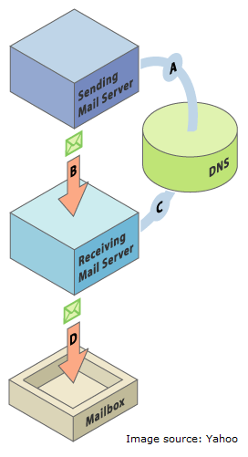

# メール配信品質向上のための SPF と DKIM の設定 {#set-up-spf-and-dkim-for-your-email-deliverability}

メール到達率を向上させるための簡単な方法の 1 つは、**SPF**（送信者ポリシーの枠組み）および **DKIM**（ドメインキー識別メール）を DNS 設定に追加することです。 このDNS エントリに加えて、Marketoが自分に代わってメールを送信することを許可したことを受信者に伝えます。 この変更を行わないと、メールは差出人としては自社ドメインが指定されている一方で、実際の送信元は Marketo ドメインの IP アドレスとなるため、スパムとしてマークされる可能性が高くなります。

>[!CAUTION]
>
>ネットワーク管理者は、DNS レコードでこの変更を行う必要があります。

## SPF の設定 {#set-up-spf}

**ドメインに SPF レコードがない場合**

DNS エントリに次の行を追加するよう、ネットワーク管理者に依頼します。 [domain] を Web サイトのメインドメイン（例： 「company.com」）で置き換え、[corpIP] を会社のメールサーバーの IP アドレス（例： &quot;255.255.255.255&quot;). Marketo を通じて複数のドメインからメールを送信する場合は、これを各ドメインに（1 行で）追加する必要があります。

`[domain] IN TXT v=spf1 mx ip4:[corpIP] include:mktomail.com ~all`

**ドメインに SPF レコードがある場合**

DNS エントリに既に SPF レコードが存在する場合は、次を追加します。

include:mktomail.com

## DKIM の設定 {#set-up-dkim}

**DKIM とは DKIM を設定する理由**

DKIM は、メール受信者が、そのメールメッセージが表示されている送信者本人から実際に送信されたものかどうかを判断するために使用される認証プロトコルです。 多くの場合、受信者はメッセージが偽造ではないと確信できるので、DKIM はメールのインボックスへの配信品質を向上させます。

**DKIM の仕組み**

DNS レコードで公開鍵を設定し、「管理」セクション（A）で送信ドメインをアクティブ化すると、Marketoは送信メッセージに対するカスタム DKIM署名を有効にします。この署名には、送信メッセージに代わって送信される電子メールごとに暗号化されたデジタル署名が含まれます（B）。 受信者は、送信ドメインの DNS の「公開鍵」（C）を検索することで、デジタル署名を復号できます。 メール内のキーが DNS レコードのキーに対応している場合、受信側のメールサーバーは、Marketo がお客様に代わって送信したメールを受け入れる可能性が高くなります。

**DKIM の設定方法を教えてください。**

[ カスタム DKIM署名の設定](/help/marketo/product-docs/email-marketing/deliverability/set-up-a-custom-dkim-signature.md){target="_blank"}を参照してください。

>[!MORELIKETHIS]
>
>* SPFの詳細と仕組みについて：`http://www.open-spf.org/Introduction/`
>* SPF は正しく設定されていますか？`https://www.kitterman.com/spf/validate.html`
>* 正しい構文を使用しましたか？`http://www.open-spf.org/SPF_Record_Syntax/`
