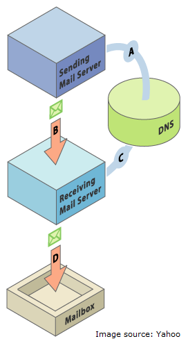

# Eメール配信品質のSPFとDKIMの設定{#set-up-spf-and-dkim-for-your-email-deliverability}

電子メールの配信率を向上させる1つの簡単な方法は、**SPF** (Sender Policy Framework)と&#x200B;**DKIM** (Domain Keys Identified Mail)をDNS設定に組み込むことです。 DNSエントリに加えて、Marketingが自分の代わりに電子メールを送信することを承認したことを受信者に伝えています。 この変更を行わないと、電子メールはドメインから送信された電子メールですが、MarketoドメインのIPアドレスから送信された電子メールであるため、スパムとしてマークされる可能性が高くなります。

>[!CAUTION]
>
>この変更をDNSレコードに行うには、ネットワーク管理者が必要です。

## SPF {#set-up-spf}の設定

**ドメインにSPFレコードがない場合**

ネットワーク管理者に問い合わせて、DNSエントリに次の行を追加してください。 [domain]をWebサイトのメインドメイン(例： &quot;会社.com&quot;)と[corpIP]を、会社の電子メールサーバーのIPアドレス(例： &quot;255.255.255.255&quot;)。 Marketorを通じて複数のドメインからの電子メールを送信する場合は、この電子メールを各ドメインに（1行で）追加する必要があります。
[] domainIN TXT v=spf1 mx ip4:[] corpIPinclude:mktomail.com ～all\
ドメインにSPFレコードがある場合

DNSエントリに既にSPFレコードがある場合は、次を追加します。

include:mktomail.com

## DKIM {#set-up-dkim}の設定

### DKIMとは？ DKIMを設定する理由{#what-is-dkim-why-do-i-want-to-set-up-dkim}

DKIMは、電子メールの受信者が、電子メールの送信者によって電子メールメッセージが送信されたかどうかを判断するために使用する認証プロトコルです。 DKIMは、受信者がメッセージが偽造でないと確信できるので、受信トレイへの電子メールの配信品質を向上させることがよくあります。

DKIMの仕組みは？

DNSレコードに公開鍵を設定し、管理者セクション(A)で送信ドメインをアクティブにした後、送信メッセージに対するカスタムDKIM署名を有効にします。この設定には、送信する各電子メールと共に暗号化された電子署名が含まれます(B)。 受信側は、送信側ドメインのDNS(C)の「公開鍵」を調べることで、デジタル署名を復号化できます。 電子メール内のキーがDNSレコード内のキーに対応している場合、受信側のメールサーバーは、送信元の電子メールマーケティング担当者に代わって送信された電子メールを受け入れる可能性が高くなります。

DKIMの設定方法

[カスタムDKIM署名の設定](set-up-a-custom-dkim-signature.md)を参照してください。

>[!MORELIKETHIS]
>
>* [SPFの詳細と仕組み](http://www.open-spf.org/Introduction/)
>* [マーケティング担当者向け電子メール配信品質ツール](https://www.marketo.com/software/email-marketing/email-deliverability/)
>* [SPFが正しく設定されているか](http://www.kitterman.com/spf/validate.html)
>* [正しい構文を使用したか。](http://www.open-spf.org/SPF_Record_Syntax/)

>

