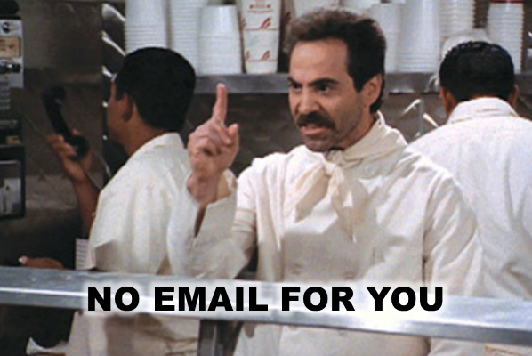

# 登録解除について {#understanding-unsubscribe}

Marketoには、組み込みの登録解除にはいくつかの種類があります。 ファーストネームと同様に、すべてperson オブジェクトのフィールドで表されます。

これらのフィールドはすべて、お使いの Marketo サブスクリプションにビルトインされています。 これらはすべてブール型（チェックボックス）です。 これらは Forms または[データ値を変更](/help/marketo/product-docs/core-marketo-concepts/smart-campaigns/flow-actions/change-data-value.md)フローステップで使用できます。

## 配信停止完了 {#unsubscribed}

これは、標準の登録解除ページで使用されます。 人物がこのボックスをオンにするか、メール内の登録解除リンクをクリックすると、その人物はマーケティングメールを受け取らなくなります。 ただし、[オペレーショナルメール](/help/marketo/product-docs/email-marketing/general/functions-in-the-editor/make-an-email-operational.md)は受け取ります。

## マーケティングを中断したリード {#marketing-suspended}

このフィールドは、ユーザーが人物を一時的な登録解除状態にするために設定します。 人物は、手動で変更されるか、データ値の変更フローステップが利用された場合にのみ、このステータスになることができます。

## メールの中断 {#email-suspended}

このステータスは、ハードバウンスが発生してから 24 時間の間、その人物へのメール送信をブロックします。 24 時間後、その人物は再びメール送信の対象になります。

>[!NOTE]
>
>「メールの中断」フィールドは、24 時間が過ぎてもチェックされたままになるので、過去にそのようにマークされた人物を特定できます。 顧客が郵送可能かどうかを確認するには、電子メールの配信を停止してから24時間後に計算します。

## ブロックリスト登録済み {#blocklisted}

[競合他社などの人物に使用](/help/marketo/product-docs/core-marketo-concepts/smart-lists-and-static-lists/managing-people-in-smart-lists/add-person-to-blocklist.md)。 **no**&#x200B;のメールを受信したい方は誰でも、運用上、マーケティング上などのメールを受信できます。メールは届きません。

