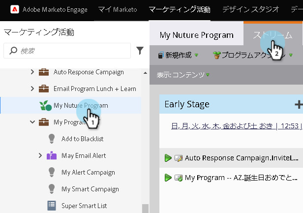
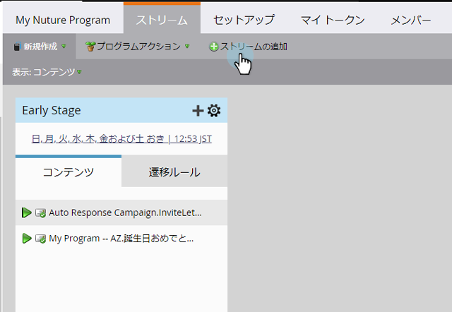
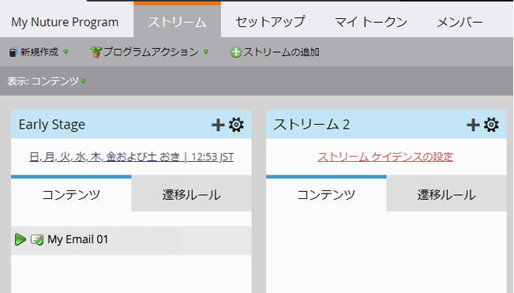

# 追加流れ {#add-a-stream}

エンゲージメントプログラムは複数のストリームを保持できます。 新しいのを追加する方法を次に示します。

1. 「 **マーケティングアクティビティ**」に移動します。

   

1. エンゲージメントプログラムを選択し、「 **Streams** 」タブをクリックします。

   

1. 「 **追加ストリーム**」をクリックします。

   

   >[!NOTE]
   >
   >エンゲージメントプログラムあたり最大25のストリームを追加できます。

   そして…完了！   

