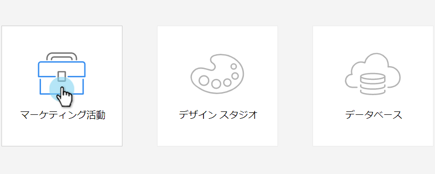
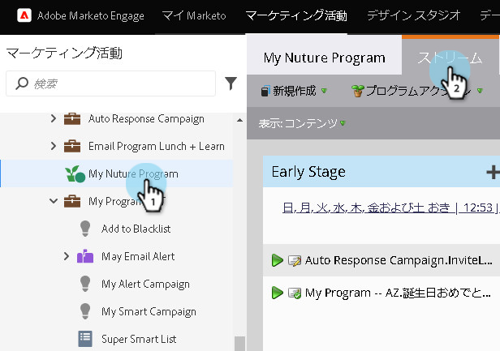
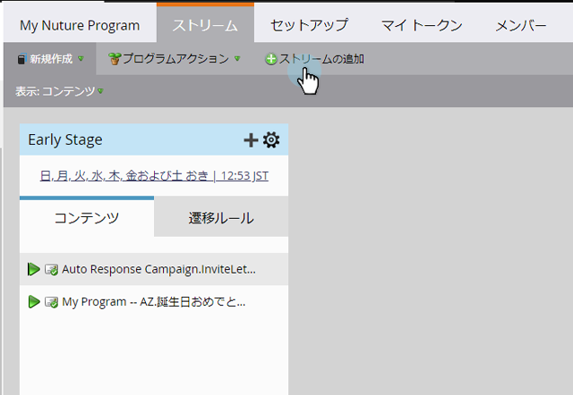
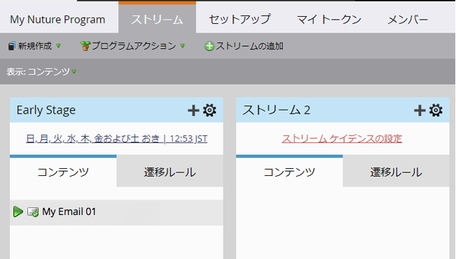

# ストリームの追加 {#add-a-stream}

エンゲージメントプログラムには複数のストリームを追加できます。

1. **[!UICONTROL マーケティングアクティビティ]**&#x200B;に移動します。

   

1. エンゲージメントプログラムを選択して、「**[!UICONTROL ストリーム]**」タブをクリックします。

   

1. 「**[!UICONTROL ストリームを追加]**」をクリックします。

   

   >[!NOTE]
   >
   >エンゲージメントプログラムあたり最大 25 個のストリームを追加できます。

   
