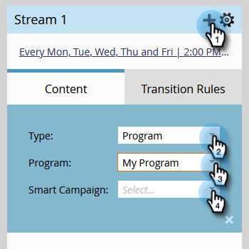

# ストリームにコンテンツを追加する {#add-content-to-a-stream}

エンゲージメントプログラムを作成したら、ストリームにコンテンツを追加する必要があります。ストリームにメールまたはプログラムを追加できます。

1. 「**マーケティングアクティビティ**」に移動します。

   

1. エンゲージメントプログラムを選択し、「**ストリーム**」タブに移動します。

   

   次の 2 つの方法でコンテンツを追加できます。

**「コンテンツの追加」ボタン**

1. 「**コンテンツの追加**」ボタンをクリックします。

   

1. 「**電子メール**_」または「_**プログラム**」を選択して、追加するメールまたはプログラム／スマートキャンペーンを選択します。

   

   >[!TIP]
   >
   >このエンゲージメントプログラムのローカルのメールは、上に並べ替えられます。

**+ アイコン**

1. **+** アイコンをクリックして、「**電子メール**_」または「_ **プログラム**」をクリックし、追加するメールまたはプログラム／スマートキャンペーンを選択します。

   

   >[!NOTE]
   >
   >スマートキャンペーンが正しく機能するには、**エンゲージメントプログラムのメンバー**&#x200B;フィルターが含まれている必要があります。

完成です。これで、プログラムストリームにコンテンツを追加する方法がわかりました。ナーチャリングに必要なコンテンツを好きなだけ追加しましょう。詳しくは、以下の関連記事を参照してください。

>[!MORELIKETHIS]
>
>[エンゲージメントプログラムストリームへのプログラムの追加](/help/marketo/product-docs/email-marketing/drip-nurturing/creating-an-engagement-program/adding-a-program-to-an-engagement-program-stream.md)
