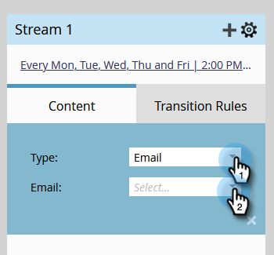

# ストリームにコンテンツを追加する {#add-content-to-a-stream}

エンゲージメントプログラムを作成したら、ストリームにコンテンツを追加する必要があります。ストリームにメールまたはプログラムを追加できます。

1. 「**マーケティングアクティビティ**」に移動します。

   

1. エンゲージメントプログラムを選択し、「**ストリーム**」タブに移動します。

   

   コンテンツは、次の2つの方法で追加できます。

**「コンテンツの追加」ボタン**

1. 「**コンテンツの追加**」ボタンをクリックします。

   

1. **Eメール** _または_ **プログラム**&#x200B;を選択し、追加する電子メールまたはプログラム/スマートキャンペーンを選択します。

   

   >[!TIP]
   >
   >このエンゲージメントプログラムのローカルのメールは、上に並べ替えられます。

**+ アイコン**

1. **+**&#x200B;アイコンをクリックし、「**Eメール** _」または「_ **プログラム**」を選択して、追加する電子メールまたはプログラム/スマートキャンペーンを選択します。

   

   >[!NOTE]
   >
   >スマートキャンペーンが正しく機能するには、**エンゲージメントプログラムのメンバー**&#x200B;フィルターがスマートキャンペーンに含まれている必要があります。

完成です。これで、コンテンツをプログラムストリームに追加する方法がわかります。 必要な分だけ養育を加えなさい。 詳しくは、以下の関連記事を参照してください。

>[!MORELIKETHIS]
>
>[エンゲージメントプログラムストリームへのプログラムの追加](/help/marketo/product-docs/email-marketing/drip-nurturing/creating-an-engagement-program/adding-a-program-to-an-engagement-program-stream.md)
