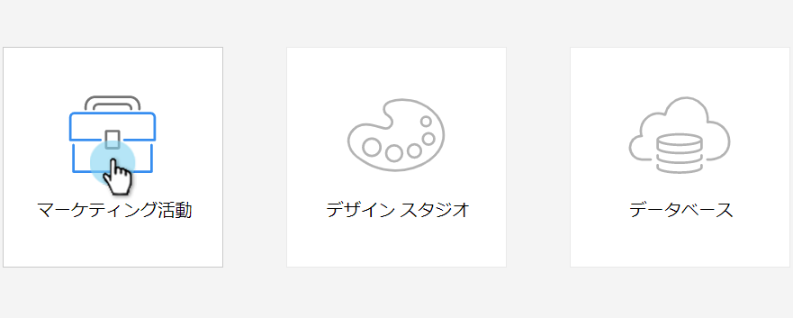

# エンゲージメントプログラムの作成 {#create-an-engagement-program}

Marketoのエンゲージメントプログラムを使用すると、E メールの育成を簡単におこなうことができます。

1. **マーケティングアクティビティ**&#x200B;に移動します。

   

1. エンゲージメントプログラムを作成するフォルダを選択し、 **新規** および **新規プログラム**.

   

1. を入力します。 **名前**&#x200B;を選択します。 **エンゲージメント** 対象 **プログラムタイプ** をクリックし、 **作成**.

   

1. さて、エンゲージメントプログラムができたので、前に進んで着替えましょう。

   

   >[!MORELIKETHIS]
   >
   >* [ストリームにコンテンツを追加する](/help/marketo/product-docs/email-marketing/drip-nurturing/creating-an-engagement-program/add-content-to-a-stream.md)
   >* [ストリームケイデンスの設定](/help/marketo/product-docs/email-marketing/drip-nurturing/engagement-program-streams/set-stream-cadence.md)

