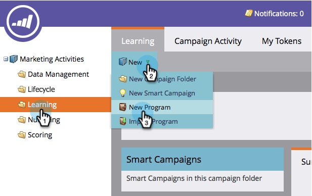

# エンゲージメントプログラムの作成 {#create-an-engagement-program}

Marketo のエンゲージメントプログラムを使用すると、メールのナーチャリングを簡単におこなうことができます。

1. **マーケティングアクティビティ**&#x200B;に移動します。

   

1. エンゲージメントプログラムを作成するフォルダーを選択し、**新規**／**新規プログラム**&#x200B;をクリックします。

   

1. **名前**&#x200B;入力し、「**プログラムタイプ**」の「**エンゲージメント**」を選択して、「**作成**」をクリックします。

   

1. さて、エンゲージメントプログラムができたので、前に進んで装飾を加えましょう。

   

   >[!MORELIKETHIS]
   >
   >* [ストリームにコンテンツを追加する](/help/marketo/product-docs/email-marketing/drip-nurturing/creating-an-engagement-program/add-content-to-a-stream.md)
   >* [ストリームケイデンスの設定](/help/marketo/product-docs/email-marketing/drip-nurturing/engagement-program-streams/set-stream-cadence.md)

