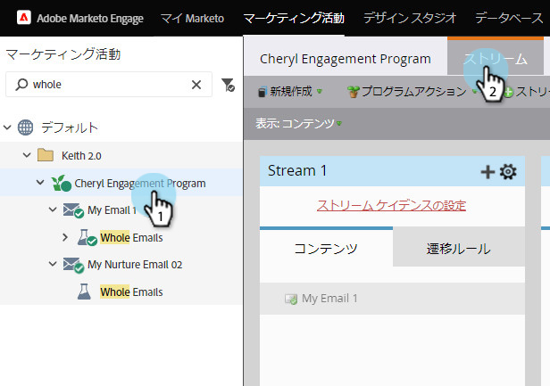

# ストリームの削除{#delete-a-stream}

エンゲージメントプログラムからストリームを削除する必要が生じた場合は、次の手順に従って、簡単に操作できます。

1. **マーケティングアクティビティ**&#x200B;に移動します。

   

1. エンゲージメントプログラムを選択し、**Streams**&#x200B;に移動します。

   

   >[!CAUTION]
   >
   >ストリームを削除すると、そのストリーム内のコンテンツの履歴データが失われます。

1. 歯車アイコンをクリックし、「**削除**」を選択します。

   

1. 「**削除**」をクリックして、削除を確定します。

   

   >[!NOTE]
   >
   >ストリームに人が含まれている場合は、まず人を外に出すよう求められます。
