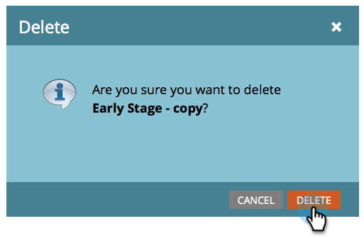

# ストリームを削除する {#delete-a-stream}

エンゲージメントプログラムからストリームを削除する必要がある場合は、次の手順を実行します。

1. 「**マーケティングアクティビティ**」に移動します。

   

1. エンゲージメントプログラムを選択して、「**ストリーム**」に移動します。

   

   >[!CAUTION]
   >
   >ストリームを削除すると、そのストリーム内のコンテンツの履歴データが失われます。

1. 歯車アイコンをクリックし、「**削除**」を選択します。

   

1. 「**削除**」をクリックして、削除を確定します。

   

   >[!NOTE]
   >
   >ストリームにリードが含まれている場合は、まずリードを[移動](/help/marketo/product-docs/core-marketo-concepts/smart-campaigns/program-flow-actions/change-engagement-program-stream.md)するように求められます。
