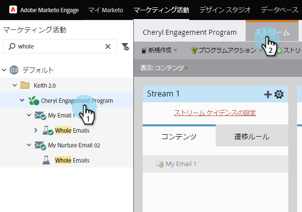

# ストリーム名の変更{#rename-a-stream}

ストリームの整理を維持したい場合は、ストリームの名前を変更できます。 その方法を次に示します。

1. エンゲージメントプログラムを探して選択し、「**Streams**」をクリックします。

   

1. 現在のストリーム名を重複キーを押しながらクリックします。

   

1. 新しいストリーム&#x200B;**名前**&#x200B;を入力し、**保存**&#x200B;をクリックします。

   

   さあ、 これで、ストリームの名前の変更方法がわかります。
