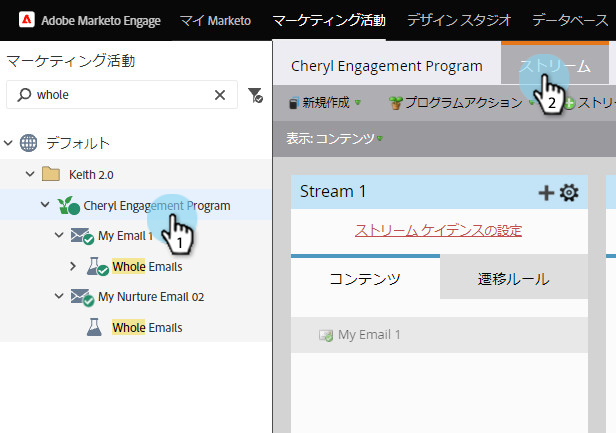

# ストリーム名の変更 {#rename-a-stream}

整理された状態を維持したい場合は、ストリーム名を変更できます。

1. エンゲージメントプログラムを検索して選択し、「**[!UICONTROL ストリーム]**」をクリックします。

   

1. 現在のストリーム名をダブルクリックします。

   

1. 新しいストリームの「**[!UICONTROL 名前]**」を入力して、「**[!UICONTROL 保存]**」をクリックします。

   
