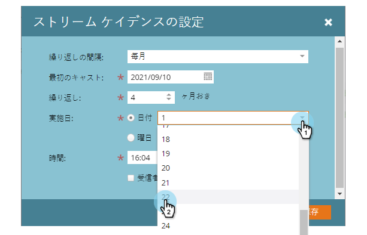
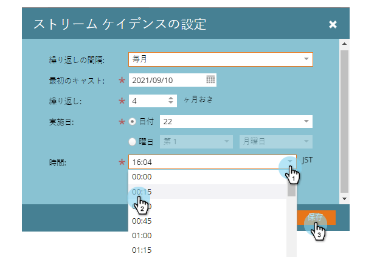

# Set Stream Cadence {#set-stream-cadence}

エンゲージメントのコンテンツは、任意の間隔で送信できます。 次に例を示します。週に1回、または月の第3火曜日に1回。

## カデンスを設定{#set-cadence}

1. **マーケティングアクティビティ**&#x200B;に移動します。

   

1. エンゲージメントプログラムを探して選択し、「**Streams**」タブをクリックして、「**Set Stream Cadence**」をクリックします。

   

1. カデンスを繰り返す頻度を選択します。 **週単位**&#x200B;または&#x200B;**月単位**&#x200B;を選択できます。

## 週単位{#weekly}

1. 「**週単位**」を選択します。

   

   >[!NOTE]
   >
   >「**なし**」を選択すると、ストリームが停止します。

1. 最初のキャストの日付を選択します。

   

1. 次に、カデンスを毎週、またはそれ以上の間隔で発生させるかを選択します。 2週間おきに選びましょう。

   

1. 曜日を決定します。 この場合は、火曜、水曜、木曜にしましょう。

   

   >[!TIP]
   >
   >**繰り返しを選択すると、毎日カデンスを実行するように設定できます。毎週** / **間隔：1週間** / ****:何日も。

   次に、時間を選択します。 [受信者タイムゾーン](/help/marketo/product-docs/email-marketing/drip-nurturing/engagement-program-streams/set-stream-cadence/schedule-engagement-programs-with-recipient-time-zone.md)（つまり、ローカルタイムゾーンに従って配信）を使用する場合は、このチェックボックスをオンにし、[**保存**]をクリックします。

   

   >[!CAUTION]
   >
   >コンテンツは、最初のキャストとして選択した日付に配置され、選択した曜日と一致するようにします。さもなければ、最初の週に2回外出する。

1. カデンスの上にカーソルを置きます。 未来のキャストが外に出る日が分かるでしょう。

   

   >[!NOTE]
   >
   >この例では、木曜日に電子メールが送信されます。 次に、1週間スキップして、翌週の火曜日、水曜日、木曜日に再度送信します。 そしてまたループを繰り返します

それだ！ 月次カデンスを設定する場合は、読み続けてください。

## 毎月{#monthly}

1. **「月別**」を選択して、繰り返しの頻度を指定します。

   

1. 最初のキャストの日付を選択します。

   

1. 毎月またはそれ以上の間隔を空ける場合に選択します。4か月ごとに選びましょう。

   

1. 指定した月の何日かを選択します。この場合は4か月ごとの22日です。

   

   >[!TIP]
   >
   >または、曜日を選択することもできます。

1. **時間**&#x200B;を選択し、**保存**&#x200B;をクリックします。

   

1. カデンスの上にカーソルを置きます。 未来のキャストが外に出る日が分かるでしょう。

   

   >[!CAUTION]
   >
   >後でエンゲージメントストリームのカデンスを変更する場合は、最初のキャストが未来の日付に設定されていることを確認します。

流れのカデンスの設定方法を知ってる！

>[!MORELIKETHIS]
>
>* [受信者のタイムゾーンについて](/help/marketo/product-docs/email-marketing/email-programs/email-program-actions/scheduling-with-recipient-time-zone/understanding-recipient-time-zone.md)
>* [受信者のタイムゾーンでのエンゲージメントプログラムのスケジュール](/help/marketo/product-docs/email-marketing/drip-nurturing/engagement-program-streams/set-stream-cadence/schedule-engagement-programs-with-recipient-time-zone.md)

