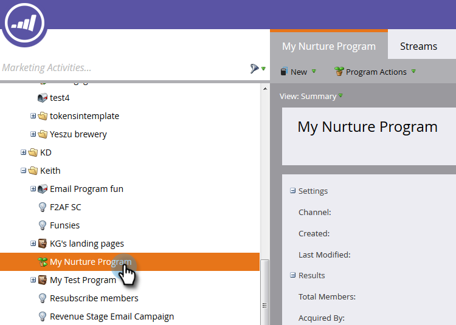
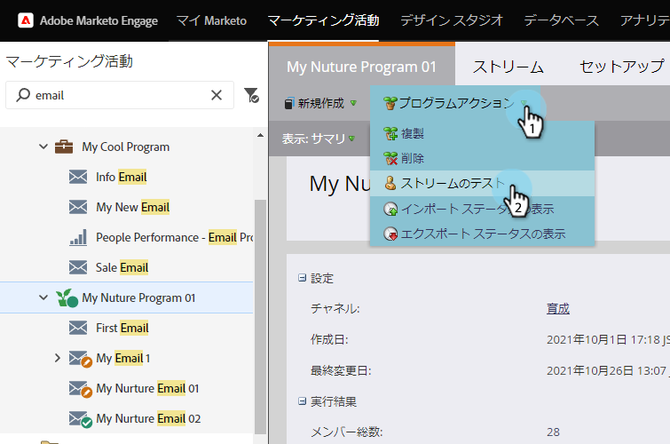
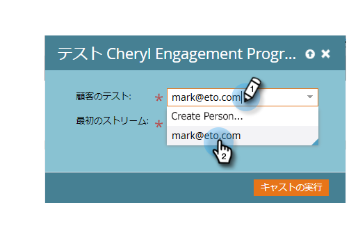

# エンゲージメントストリームのテスト {#test-an-engagement-stream}

すべてのコンテンツをストリームに追加した後、一度にそれらを1つずつテストできます。

1. **[!UICONTROL マーケティングアクティビティ]**&#x200B;に移動します。

   

1. エンゲージメントプログラムを選択します。

   

1. 「**[!UICONTROL プログラムアクション]**」をクリックして、「**[!UICONTROL ストリームをテスト]**」を選択します。

   

1. **[!UICONTROL ユーザーをテスト]**&#x200B;ドロップダウンからユーザーを選択します。 コンテンツが実際に送信されるので、選択する際にはその点に留意してください。

   

   >[!CAUTION]
   >
   >テスト担当者が一意であり、データベースに重複がないことを確認します。

   >[!TIP]
   >
   >探しているテスト担当者が存在しない場合は、「**[!UICONTROL ユーザーを作成]**」オプションを使用して、その場で作成します。

   「**[!UICONTROL 初期ストリーム]**」をクリックし、テストするストリームを選択し、「**[!UICONTROL キャストを実行]**」をクリックします。
   

1. ユーザーが、以前に設定した[トランジションルール](/help/marketo/product-docs/email-marketing/drip-nurturing/engagement-program-streams/transition-people-between-engagement-streams.md)に入った場合は、更新アイコンをクリックします。

   

1. 新しいストリームが表示され、テストの成功を示します。

   

   >[!NOTE]
   >
   >「**[!UICONTROL キャストを再実行]**」をクリックしない限り、他のコンテンツが送信されることはありません。
